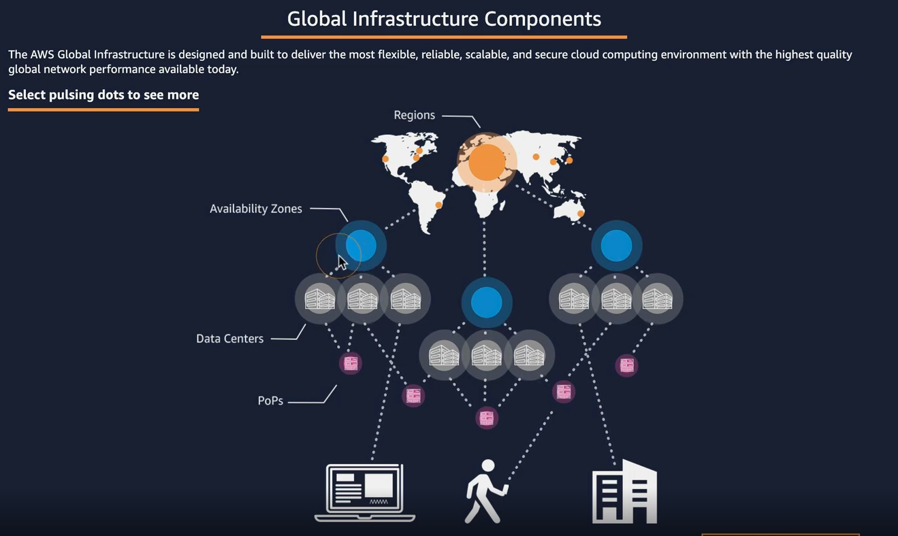

- https://www.infrastructure.aws
---

## AWS Global Infrastructure

- 가용영역(AZ)
  - `하나 이상의 데이터 센터로 구성`, 논리적 데이터센터
- 리전
  - `2개 이상의 가용영역의 모임`
    - 고가용성을 위해 최소 2개 이상의 가용영역이 모여 리전을 구성한다.
  - 각 리전은 각각 다른 AWS 서비스 제공
- 엣지 로케이션 (PoP)
  - `CDN, DNS 서비스 제공`

### 서울 리전
- 한국에서 가장 많이 사용하는 리전
- `ap-northeast-2`
  - 동북 아시아의 두번째 리전이라는 의미 
  - 4개의 AZ로 구성되어 있다.
    - ap-northeast-2a
    - ap-northeast-2b
    - ap-northeast-2c
    - ap-northeast-2d

