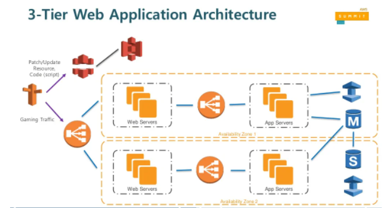

> ###  [진짜 입문자를 위한 클라우드와 AWS](https://www.inflearn.com/course/aws-starter/dashboard)을 보고 정리

 

### AWS Route 53
- AWS 에서 제공해 주는 `DNS 서비스`
- 저렴하고 `100% 가용성`을 보장해 준다
  - 절대 다운되지 않는다.
  > CDN 방식은 PoP서버에 데이터를 저장하는데 이 서버에서 AWS Route 53도 제공하기 떄문에, 
  전 세계에 모든 PoP서버가 다운되지 않는이상 AWS Route 53서비스는 다운되지 않는다.

### AWS Virtual Private Cloud(VPC)

- AWS에서 서비스를 개발 및 제공하기 위한 `가상 사설 네트워크`
- 하나의 서비스에 하나의 VPC로 시작
- VPC는 인터넷과 연결됨
- VPC는 다시 용도에 따라 subnet으로 나눔
- 각각의 subnet에서 웹서버, DB 등이 연결됨
- Public subnet: 웹서버, 메일서버 등
  - DMZ 구간과 비슷
- Private subnet: 데이터베이스, 보안 데이터, 백업 데이터 등

### 일반적인 AWS 구조

- 출처 : https://www.slideshare.net/awskorea/aws-cloud-game-architecture

AWS서비스를 사용하면 일반적으로 3-Tier Web Application Architecture 구조를 가진다.

1. 웹 서버
2. 앱 서버
3. DB

- 노란색 실선이 vpc
- 검은색 실선이 subnet
- Route 53 이 DNS제공

### 요약
- 인터넷 기반 서비스를 제공하려면 하나 이상의 서버가 필요하다.
- 각 서버를 연결하기 위한 사설 네트워크망 필요
- AWS VPC는 서비스를 위한 가상 사설 네트워크 제공
- AWS VPC는 인터넷과 연결되어 사용자에게 서비스 제공 가능

---
### 사용
- 리전 마다 기본적으로 VPC 하나씩 제공
- 보안 그룹 : 방화벽
- putty에서 pem 파일을 이용해 서버에 접속할 수는 없다. 
  > puttygen을 이용하여 .pen key파일을  .ppk key파일로 변환해야 한다.
- 보통 이미지나 동영상 같은 파일은 S3나 CloudFront을 이용하여 제공해준다.
- Route 53을 이용해 ec2서버 ip의 도메인 네임 설정 가능.

---
### Quiz

AWS에서 인터넷과 연결할 수 있는 가상 네트워크 서비스는 무엇일까?
1. `VPC`
2. NPC
3. LOL
4. VPN
5. Route53
