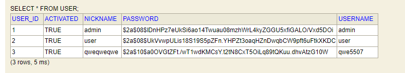
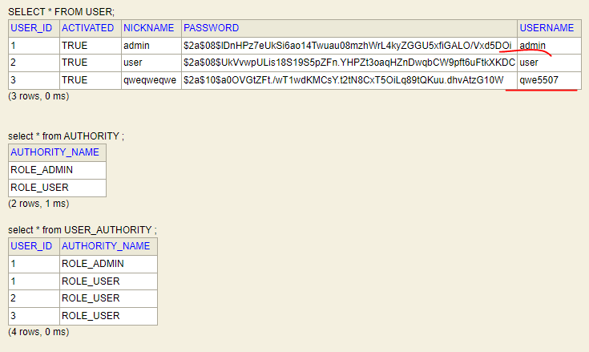

> ###  [인프런 Spring Boot JWT Tutorial](https://www.inflearn.com/course/aws-starter/dashboard)을 보고 정리

> [실습 프로젝트](https://github.com/qwe5507/jwt-tutorial)

<br>


### _SecurityUtil.java_
```java
import org.slf4j.Logger;
import org.slf4j.LoggerFactory;
import org.springframework.security.core.Authentication;
import org.springframework.security.core.context.SecurityContextHolder;
import org.springframework.security.core.userdetails.UserDetails;

import java.util.Optional;

public class SecurityUtil {

    private static final Logger logger = LoggerFactory.getLogger(SecurityUtil.class);

    private SecurityUtil() {
    }

    public static Optional<String> getCurrentUsername() {
        final Authentication authentication = SecurityContextHolder.getContext().getAuthentication();

        if (authentication == null) {
            logger.debug("Security Context에 인증 정보가 없습니다.");
            return Optional.empty();
        }

        String username = null;
        if (authentication.getPrincipal() instanceof UserDetails) {
            UserDetails springSecurityUser = (UserDetails) authentication.getPrincipal();
            username = springSecurityUser.getUsername();
        } else if (authentication.getPrincipal() instanceof String) {
            username = (String) authentication.getPrincipal();
        }

        return Optional.ofNullable(username);
    }
}
```
- `public static Optional<String> getCurrentUsername()`
  - Security Context에서 Authentication객체를 꺼내고 Authentication에서 username을 꺼내는 유틸성 메소드

- Security Context에 Authentication객체가 저장되는 시점 
  - Jwtilter의 doilter메소드에 Request가 들어올때 저장

### **회원가입 API 생성**

### _UserService.java_
```java
import me.silvernine.tutorial.dto.UserDto;
import me.silvernine.tutorial.entity.Authority;
import me.silvernine.tutorial.entity.User;
import me.silvernine.tutorial.repository.UserRepository;
import me.silvernine.tutorial.util.SecurityUtil;
import org.springframework.security.crypto.password.PasswordEncoder;
import org.springframework.stereotype.Service;
import org.springframework.transaction.annotation.Transactional;
 
import java.util.Collections;
import java.util.Optional;
 
@Service
public class UserService {
    private final UserRepository userRepository;
    private final PasswordEncoder passwordEncoder;
 
    public UserService(UserRepository userRepository, PasswordEncoder passwordEncoder) {
        this.userRepository = userRepository;
        this.passwordEncoder = passwordEncoder;
    }
 
    @Transactional
    public User signup(UserDto userDto) {
        if (userRepository.findOneWithAuthoritiesByUsername(userDto.getUsername()).orElse(null) != null) {
            throw new RuntimeException("이미 가입되어 있는 유저입니다.");
        }
 
        Authority authority = Authority.builder()
                .authorityName("ROLE_USER")
                .build();
 
        User user = User.builder()
                .username(userDto.getUsername())
                .password(passwordEncoder.encode(userDto.getPassword()))
                .nickname(userDto.getNickname())
                .authorities(Collections.singleton(authority))
                .activated(true)
                .build();
 
        return userRepository.save(user);
    }
 
    @Transactional(readOnly = true)
    public Optional<User> getUserWithAuthorities(String username) {
        return userRepository.findOneWithAuthoritiesByUsername(username);
    }
 
    @Transactional(readOnly = true)
    public Optional<User> getMyUserWithAuthorities() {
        return SecurityUtil.getCurrentUsername().flatMap(userRepository::findOneWithAuthoritiesByUsername);
    }
}
```
- `UserRepository`, `PasswordEncoder` 을 주입

- `public User signup(UserDto userDto)`
  - 회원 가입 메소드
  - 중복 체크후 DB에 존재 하지 않으면 
  - 권한정보 생성 후 권한정보와 유저 정보를 DB에 저장
    - data.sql에서 admin은 'ROLE_USER'와 'ROLE_ADMIN' 두 권한을 가지고 있다.
    - signup메소드를 통해 가입한 'ROLE_USER'만 가지고 있다.
    > 중요! 이 메소드를 통해 생성되는 유저는 ROLE_USER 권한을 소유합니다. 이 메소드를 통해 가입한 유저는 ROLE_ADMIN 권한만 호출할 수 있는 API는 호출할 수 없다.

- `public Optional<User> getUserWithAuthorities(String username)`
  - username을 가지고 유저정보 와 권한정보를 가져온다.

- `public Optional<User> getMyUserWithAuthorities()`
  - 현재 SecurityContext에 저장되어 있는 username의 정보를 가져온다. 

### _UserController.java_
```java
import me.silvernine.tutorial.dto.UserDto;
import me.silvernine.tutorial.entity.User;
import me.silvernine.tutorial.service.UserService;
import org.springframework.http.ResponseEntity;
import org.springframework.security.access.prepost.PreAuthorize;
import org.springframework.web.bind.annotation.*;
 
import javax.validation.Valid;
 
@RestController
@RequestMapping("/api")
public class UserController {
    private final UserService userService;
 
    public UserController(UserService userService) {
        this.userService = userService;
    }
 
    @PostMapping("/signup")
    public ResponseEntity<User> signup(
            @Valid @RequestBody UserDto userDto
    ) {
        return ResponseEntity.ok(userService.signup(userDto));
    }
 
    @GetMapping("/user")
    @PreAuthorize("hasAnyRole('USER','ADMIN')")
    public ResponseEntity<User> getMyUserInfo() {
        return ResponseEntity.ok(userService.getMyUserWithAuthorities().get());
    }
 
    @GetMapping("/user/{username}")
    @PreAuthorize("hasAnyRole('ADMIN')")
    public ResponseEntity<User> getUserInfo(@PathVariable String username) {
        return ResponseEntity.ok(userService.getUserWithAuthorities(username).get());
    }
}
```

- `public ResponseEntity<User> signup`
  - 회원가입 api


- `public ResponseEntity<User> getMyUserInfo()`
  - **@PreAuthorize을 통해 'USER','ADMIN' 두가지 권한 모드 허용**


- `public ResponseEntity<User> getUserInfo(@PathVariable String username)`
  - **'ADMIN'권한만 호출 할 수 있도록 설정**

**회원가입 테스트**

requeset
```
POST http://localhost:8080/api/signup

{
    "username":"qwe5507 ",
    "password":"qwe5507",
    "nickname":"qweqweqwe"
}

```
response
```
{
    "userId": 3,
    "username": "qwe5507 ",
    "password": "$2a$10$a0OVGtZFt./wT1wdKMCsY.t2tN8CxT5OiLq89tQKuu.dhvAtzG10W",
    "nickname": "qweqweqwe",
    "activated": true,
    "authorities": [
        {
            "authorityName": "ROLE_USER"
        }
    ]
}
```



- qwe5507 계정 등록 확인



- admin 계정은 `ROLE_ADMIN`, `ROLE_USER` 
- 방금 생성한 qwe5507 계정은 `ROLE_USER` 권한만 가지고 있다.

### **권한검증 확인**
qwe5507계정으로 `/api/authenticate` 요청후 받았던 jwt토큰을 헤더에 추가 
- qwe5507계정은 `ROLE_USER` 권한만 있는 상태

01.request
```
GET || http://localhost:8080/api/user
```
01.response
```
{
    "userId": 4,
    "username": "qwe5507",
    "password": "$2a$10$xg/LUYLqQcyDUk2VSh8.4ubR6nVCgByLtFIvFihTLoIAusmqdRUjS",
    "nickname": "qwe",
    "activated": true,
    "authorities": [
        {
            "authorityName": "ROLE_USER"
        }
    ]
}
```

02.request
```
GET || http://localhost:8080/api/user/qwe5507
```
02.response
```
{
    "timestamp": "2022-04-17T05:31:56.237+00:00",
    "status": 403,
    "error": "Forbidden",
    "path": "/api/user/qwe5507s"
}
```
- 전에 작성했던 `JwtAccessDeniedHandler` 가 잘 작동하여 액세스가 거부되면 403를 리턴한다.


- qwe5507는 `ROLE_USER` 권한만 가지고 있어서 qwe5507로 요청한 jwt토큰 으로는 
  - `GET || http://localhost:8080/api/user/qwe5507`요청을 수행할 수 없다.

