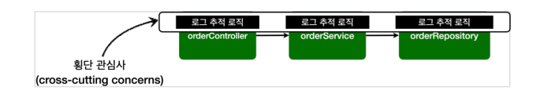
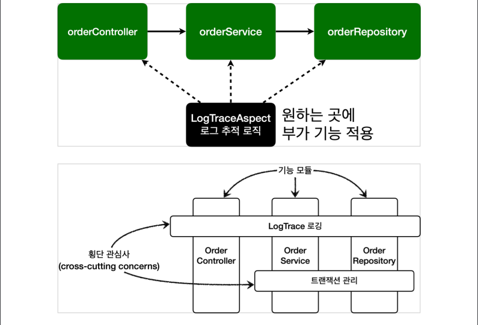

> - [스프링 핵심 원리 - 고급편](https://www.inflearn.com/course/%EC%8A%A4%ED%94%84%EB%A7%81-%ED%95%B5%EC%8B%AC-%EC%9B%90%EB%A6%AC-%EA%B3%A0%EA%B8%89%ED%8E%B8/dashboard) 을 보고 정리

<br>

## AOP 소개
어플리케이션 로직은 `핵심기능`과 `부가기능`으로 나눌 수 있다.

**핵심기능**
- 비즈니스 로직

**부가기능**
- 핵심 기능을 보조
- 단독으로 사용되지 않고 핵심기능과 함께 사용
- 로그 추적 로직, 트랜잭션 기능.. 

---
로그 추적을 하기위한 로직을 예로 들면 <br>
아래와 같이 `로그 추적을 하기위한 부가기능` 관련 로직을 <br> 
모든 코드에 사용해야 한다. 



이러한 부가기능을 `횡단 관심사(cross-cutting concerns)`라고 한다.

**이러한 부가기능을 모든코드에 적용할때 문제가 발생한다.** 

### 부가기능 적용 문제 
- 부가 기능을 적용할 때 아주 많은 반복이 필요하다.
- 부가 기능이 여러 곳에 퍼져서 중복 코드를 만들어낸다.
- 부가 기능을 변경할 때 중복 때문에 많은 수정이 필요하다.
- 부가 기능의 적용 대상을 변경할 때 많은 수정이 필요하다 

이러한 문제들로 어플리케이션 전반에 부가기능을 적용하는 문제를 `일반적인 OOP 방식으로 해결하기는 어렵다.`<br>
- 이럴때 AOP를 사용하여 부가기능을 적용해야 한다.

---
```
참고
Filter, Interceptor등을 통해서도 부가기능을 적용할 수 있겠지만, 
일반적으로 HTTP에서 제공하는 파라미터를 활용이 필요한 웹과 관련된 공통 작업(특정 메뉴 접근 권한 확인, 로그인 여부 확인)은 Filter, Interceptor를 사용
순수한 자바코드를 통한 공통(부가)기능은 AOP를 사용한다.
```
<br>

부가기능 적용의 문제로 인해 `부가기능을 핵심 기능에서 분리하고 한곳에서 관리`하도록 했으며<br>
`부가 기능을 어디에 적용할지 선택하는 기능`도 개발되었다.

## AOP 소개 - 애스펙트

`부가기능`과 `부가기능을 어디에 적용할지 선택하는 기능`을 합해서 `애스펙트(aspect)`라고 한다. 

- `스프링이 제공하는 어드바이저`도 **어드바이스(부가기능)** 와 **포인트컷(적용대상)** 을 가지고 있어 개념상 하나의 애스펙트 이다.
- 애스펙트를 사용한 프로그래밍 방식을 `관점지향 프로그래밍 AOP(Aspect-Oriented Programming)`이라 한다.

> AOP는 OOP를 대체하기 위한 것이 아니라 횡당 관심사를 깔끔하게 처리하기위해 OOP를 보조하는 목적으로 개발 되었다.


- 애스펙트는 관점이라는 뜻으로 애플리케이션을 바라보는 관점을 `하나하나의 기능에서 횡단 관심사 관점으로 보는 것`이다. 


### AspectJ 프레임워크
- AOP의 대표적인 구현 프레임워크
- 스프링도 AOP를 지원하지만, 대부분 AspectJ의 문법 사용
  - 그치만 AspectJ가 제공하는 기능의 일부만 제공됨

AspectJ 프레임워크는 스스로를 다음과 같이 설명한다.
- 자바 프로그래밍 언어에 대한 완벽한 관점 지향 확장
- 횡단 관심사의 깔끔한 모듈화
  - 오류 검사 및 처리
  - 동기화
  - 성능 최적화(캐싱)
  - 모니터링 및 로깅


