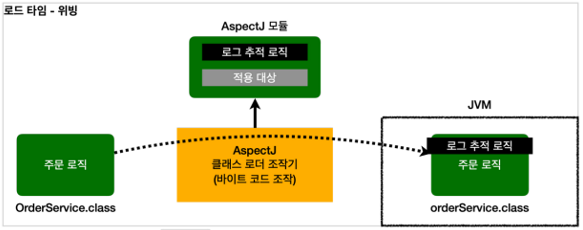

> - [스프링 핵심 원리 - 고급편](https://www.inflearn.com/course/%EC%8A%A4%ED%94%84%EB%A7%81-%ED%95%B5%EC%8B%AC-%EC%9B%90%EB%A6%AC-%EA%B3%A0%EA%B8%89%ED%8E%B8/dashboard) 을 보고 정리

<br>

## AOP 소개
어플리케이션 로직은 `핵심기능`과 `부가기능`으로 나눌 수 있다.

**핵심기능**
- 비즈니스 로직

**부가기능**
- 핵심 기능을 보조
- 단독으로 사용되지 않고 핵심기능과 함께 사용
- 로그 추적 로직, 트랜잭션 기능.. 

---
로그 추적을 하기위한 로직을 예로 들면 <br>
아래와 같이 `로그 추적을 하기위한 부가기능` 관련 로직을 <br> 
모든 코드에 사용해야 한다. 


이러한 부가기능을 `횡단 관심사(cross-cutting concerns)`라고 한다.

**이러한 부가기능을 모든코드에 적용할때 문제가 발생한다.** 

### 부가기능 적용 문제 
- 부가 기능을 적용할 때 아주 많은 반복이 필요하다.
- 부가 기능이 여러 곳에 퍼져서 중복 코드를 만들어낸다.
- 부가 기능을 변경할 때 중복 때문에 많은 수정이 필요하다.
- 부가 기능의 적용 대상을 변경할 때 많은 수정이 필요하다 

이러한 문제들로 어플리케이션 전반에 부가기능을 적용하는 문제를 `일반적인 OOP 방식으로 해결하기는 어렵다.`<br>
- 이럴때 AOP를 사용하여 부가기능을 적용해야 한다.

---
```
참고
Filter, Interceptor등을 통해서도 부가기능을 적용할 수 있겠지만, 
일반적으로 HTTP에서 제공하는 파라미터를 활용이 필요한 웹과 관련된 공통 작업(특정 메뉴 접근 권한 확인, 로그인 여부 확인)은 Filter, Interceptor를 사용
순수한 자바코드를 통한 공통(부가)기능은 AOP를 사용한다.
```
<br>

부가기능 적용의 문제로 인해 `부가기능을 핵심 기능에서 분리하고 한곳에서 관리`하도록 했으며<br>
`부가 기능을 어디에 적용할지 선택하는 기능`도 개발되었다.

## AOP 소개 - 애스펙트

`부가기능`과 `부가기능을 어디에 적용할지 선택하는 기능`을 합해서 `애스펙트(aspect)`라고 한다. 

- `스프링이 제공하는 어드바이저`도 **어드바이스(부가기능)** 와 **포인트컷(적용대상)** 을 가지고 있어 개념상 하나의 애스펙트 이다.
- 애스펙트를 사용한 프로그래밍 방식을 `관점지향 프로그래밍 AOP(Aspect-Oriented Programming)`이라 한다.

> AOP는 OOP를 대체하기 위한 것이 아니라 횡당 관심사를 깔끔하게 처리하기위해 OOP를 보조하는 목적으로 개발 되었다.


- 애스펙트는 관점이라는 뜻으로 애플리케이션을 바라보는 관점을 `하나하나의 기능에서 횡단 관심사 관점으로 보는 것`이다. 


### AspectJ 프레임워크
- AOP의 대표적인 구현 프레임워크
- 스프링도 AOP를 지원하지만, 대부분 AspectJ의 문법 사용
  - 그치만 AspectJ가 제공하는 기능의 일부만 제공됨

AspectJ 프레임워크는 스스로를 다음과 같이 설명한다.
- 자바 프로그래밍 언어에 대한 완벽한 관점 지향 확장
- 횡단 관심사의 깔끔한 모듈화
  - 오류 검사 및 처리
  - 동기화
  - 성능 최적화(캐싱)
  - 모니터링 및 로깅

<br>

## AOP 적용 방식
AOP를 사용하면 핵심기능과 부가기능 이 분리되어 관리 된다. <br>


부가기능 로직이 위와 같이 실제 로직에 추가되는 세 가지 방법이 있다.
1. 컴파일 시점
2. 클래스 로딩 시점
3. 런타임 시점(프록시)
---
### 1. 컴파일 시점 

- `.java` 소스코드를 `.class`로 만드는 컴파일 시점에 부가기능 로직 추가
- AspectJ가 제공하는 컴파일러를 사용해야 한다.
- AspectJ 컴파일러는 Aspect를 확인해서 해당 클래스가 적용 대상인지 확인하고 적용 대상인 경우 부가 로직 적용
- 이렇게 원본 로직에 부가기능 로직이 추가되는 것을 `위빙(Weaving)`이라고 한다.

**컴파일 시점 적용의 단점**<br>
컴파일 시점에 부가 기능을 적용하려면 특별한 컴파일러도 필요하고 복잡하다.


### 2. 클래스 로딩 시점

- java는 `.class`파일을 JVM 내부의 클래스 로더에 보관한다.
- java는 `.class`파일을 JVM에 저장하기 전에 조작할 수 있는 기능을 제공한다.(JAVA Instrumentation)
  - 많은 모니터링 툴에서 `JAVA Instrumentation`기술을 사용한다.
- 이 시점에 애스펙트를 적용하는 것을 `로드타임 위빙` 이라고 한다.

**클래스 로딩 시점 적용의 단점** <br>
로드타임 위빙은 자바를 실행할 때 특별한 옵션(`java -javaagent`)을 통해 클래스 로더 조작기를 지정해야 하는데, 번거롭고 운영하기 어렵다.


### 3. 런타임 시점

**런타임 시점**이란 컴파일도 끝나고, 클래스 로더에 클래스도 다 올라간 후 자바가 실행된 다음의 시점을 말한다.<br>
- 자바의 메인(main)메서드가 실행된 이후
- 런타임 시점에 AOP를 적용하려면 스프링 컨테이너, 프록시, DI, 빈 포스트 프로세서 같은 개념들을 도입해야 한다.
  - 최종적으로 **프록시를 통해 스프링 빈에 부가기능을 적용할 수 있다.**


1. 스프링 객체 생성
2. 빈 포스트 프로세서에 객체 전달
3. AspectJ 모듈을 이용해 프록시 객체 생성 대상인지 확인 (AspectJ의 어드바이저의 포인트컷을 이용) 
   - 대상이라면 프록시 객체 생성 (프록시 객체는 원본 객체를 참조하고 있음)
   - 대상이 아니라면 프록시 객체를 생성하지 않음.(그냥 원본 객체 반환)
4. 빈 프스트 프로세서가 반환한 객체를 빈 저장소에 저장


**런타임 시점의 적용의 특징**
- 프록시를 사용하기 떄문에 AOP기능에 일부 제약이 있다.
  - `생성자등에 AOP기능을 적용할 수 없고`, 메서드에만 적용 할 수 있다.
- 자바를 실행할 때 복잡한 옵션과 클래스 로더 조작기를 설정하지 않아도 된다.

---
**부가기능 적용 방식의 차이** 
- 컴파일 시점
  - 실제 대상 코드에 애스팩트를 통한 부가 기능 호출 코드가 포함된다.
  - AspectJ를 직접 사용해야 한다.
- 클래스 로딩 시점
  - 실제 대상 코드에 애스팩트를 통한 부가 기능 코드가 포함된다.
  - AspectJ를 직접 사용해야 한다.
- 런타임 시점
  - 실제 대상 코드는 그대로 유지된다. 대신 프록시를 통해 부가기능이 적용된다.
  - 스프링 AOP는 이 방식을 사용한다.

---

**AOP 적용 위치**

프록시를 통한 AOP사용은 메서드 실행일 때만 AOP를 적용할수 있지만 다른 방식은 다양한 위치에 적용 될수 있다.

- 조인포인트(Join point)
  - `AOP를 적용할 수 있는 지점`을 말한다.
  - 생성자, 필드 값, static 메서드 접근, 메서드 실행
- AspectJ를 사용해서 `컴파일 시점`과 `클래스 로딩 시점`에 적용하는 AOP는 바이트코드를 실제 조작하기 떄문에 `모든 지점에 적용할 수 있다.`
- 프록시 방식을 사용하는 스프링 AOP는 메서드 실행 지점에만 AOP를 적용할 수 있다.
  - 프록시는 `메서드 오버라이딩 개념으로 동작`한다. 따라서 `생성자나 static 메서드, 필드 값 접근에는 프록시 개념이 적용될 수 없다.`
  - 프록시를 사용하는 `스프링 AOP의 조인 포인트는 메서드 실행으로 제한`된다.
- 프록시 방식을 사용하는 `스프링 AOP`는 `스프링 컨테이너가 관리할 수 있는 스프링 빈에만 AOP를 적용할 수 있다.`

> 스프링은 AspectJ의 문법을 차용하고 프록시 방식의 AOP를 적용한다. AspectJ를 직접 사용하는 것이 아니다.

### AspectJ를 직접 사용하지 않고, 스프링 AOP를 사용하는 이유
- `AspectJ`를 직접사용하는 것이 기능이 많지만, 자바관련 설정(AspectJ 전용 문법, 자바 실행 옵션)등 복잡한 옵션을 알아야 한다.
- `스프링 AOP` 는 별도의 추가 자바 설정 없이 스프링만 있으면 편리하게 AOP 사용 가능하다.
> 실무에선 대부분의 문제를 스프링이 제공하는 AOP기능으로 해결 가능하다.

<br>

## AOP 용어 정리

- 조인 포인트(Join point)
  - 어드바이스가 적용될 수 있는 위치, 메소드 실행, 생성자 호출, 필드 값 접근, static 메서드 접근 같은 프로그램 실행 중 지점 
  - 조인 포인트는 추상적인 개념이다. AOP를 적용할 수 있는 모든 지점이라 생각하면 된다.  
  - `스프링 AOP는 프록시 방식을 사용하므로 조인 포인트는 항상 메소드 실행 지점으로 제한된다.`
- 포인트컷(Pointcut)
  - 조인 포인트 중에서 어드바이스가 적용될 위치를 선별하는 기능
  - 주로 AspectJ 표현식을 사용해서 지정
  - 프록시를 사용하는 스프링 AOP는 메서드 실행 지점만 포인트컷으로 선별 가능
- 타켓(Target)
  - 어드바이스를 받는 객체, 포인트컷으로 결정
- 어드바이스(Advice)
  - 부가 기능
  - 특정 조인 포인트에서 Aspect에 의해 취해지는 조치
  - Around(주변), Before(전), After(후)와 같은 다양한 종류의 어드바이스가 있음
- 애스펙트(Aspect)
  - 어드바이스 + 포인트컷을 모듈화 한 것
  - @Aspect 를 생각하면 됨
  - 여러 어드바이스와 포인트 컷이 함께 존재
- 어드바이저(Advisor)
  - 하나의 어드바이스와 하나의 포인트 컷으로 구성
  - 스프링 AOP에서만 사용되는 특별한 용어
- 위빙(Weaving)
  - 포인트컷으로 결정한 타켓의 조인 포인트에 어드바이스를 적용하는 것
  - 위빙을 통해 핵심 기능 코드에 영향을 주지 않고 부가 기능을 추가 할 수 있음
  - AOP 적용을 위해 애스펙트를 객체에 연결한 상태
    - 컴파일 타임(AspectJ compiler)
    - 로드 타임
    - 런타임, 스프링 AOP는 런타임, 프록시 방식
- AOP 프록시
  - AOP 기능을 구현하기 위해 만든 프록시 객체, 스프링에서 AOP 프록시는 JDK 동적 프록시 또는 CGLIB 프록시이다.


