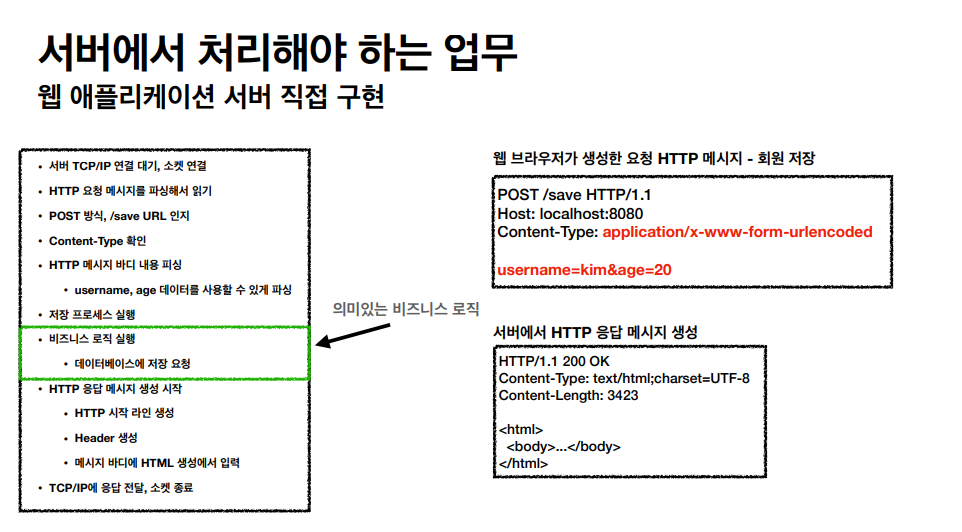
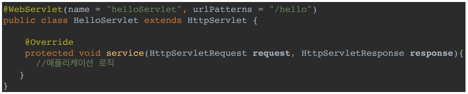
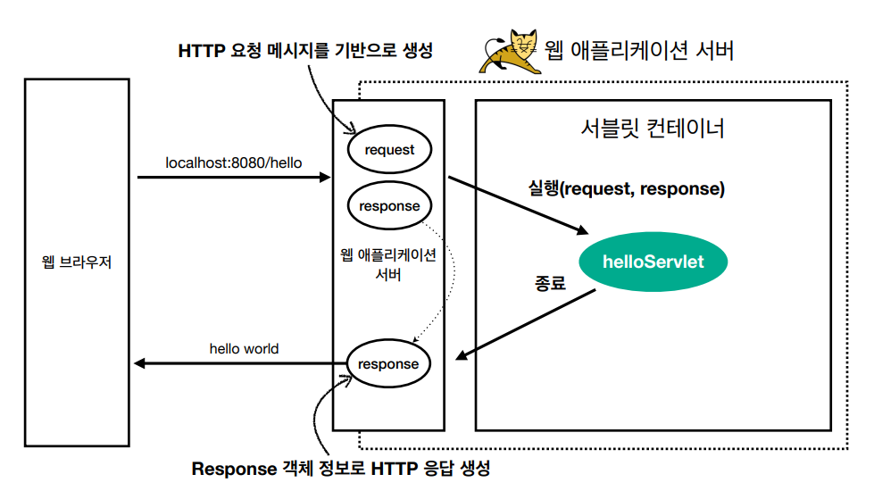

> ###  [스프링 MVC 1편 - 백엔드 웹 개발 핵심 기술](https://www.inflearn.com/course/%EC%8A%A4%ED%94%84%EB%A7%81-mvc-1/dashboard)을 보고 정리

<br>
<br>

# **웹 서버, 웹 애플리케이션 서버**

웹은 HTTP 프로토콜을 기반으로 전송 
- 거의 모든 형태의 데이터를 HTTP로 전송 가능 
- 서버간에 통신에도 대부분 HTTP 사용

## 웹 서버 (Web Server)
웹서버는 주로 정적 리소스를 제공 하는 역할
> 정적 리소스 : HTML, CSS ,JS, 이미지, 영상 등 변하지 않는 파일 

> EX) NGINX, APACHE

## 웹 애플리케이션 서버 (WAS - Web Application Server)
웹 서버 기능 + 프로그램 코드 실행하여 애플리케이션 로직 수행 동적으로 데이터를 제공  
- 동적 HTML, HTTP API(JSON)
- 서블릿, JSP, 스프링 MVC

> EX) Tomcat, Jetty, Undertow

### 웹서버와 WAS의 차이 
```
웹 서버는 정적 리소스 파일, WAS는 애플리케이션 로직 실행 

자바는 서블릿 컨테이너 기능을 제공하면 WAS로 판단했지만, 
요즘은 서블릿 없이도 자바코드를 실행하는 서버 프레임워크가 있어서 
WAS는 웹 서버에 비해 애플리케이션 코드를 실행하는데 더 특화 되어 있다고 보면 된다.
```

### 웹 시스템 구성 - WAS, DB 
WAS가 정적리소스, 애플리케이션 로직 실행하는 역할을 전부 담당하면 서버 과부하 우려
- WAS에 도달하기도 전에 장애 발생 시 오류화면 조차 전달할 수 없음.

### 웹 시스템 구성 - WEB Server, WAS, DB 
- 정적 리소스는 Web Server가 처리
- Web Server에서 동적 처리 필요 시 WAS에 요청 
- WAS 는 애플리케이션 로직 처리를 전담 

### WEB Server와 WAS를 같이 구성할 때의 장점 
```
- WAS와 웹서버의 업무를 분담 할 수 있다.
- 정적 리소스나 애플리케이션 리소스가 많이 사용 될 떄 용도에 맞는 WAS나 WEB Serve를 증설 가능
- WAS나 DB 장애시 WEB Server가 오류 화면 제공 가능
```
API만 제공하는 경우 웹서버가 없어도 된다.

## **서블릿**


```
HTTP 요청을 처리하기 위한 웹 애플리케이션 서버를 직접 구현한다면
위와 같이 TCP/IP연결 부터 클라이언트에 응답을 전달하고 소켓을 종료하는 과정 까지 비즈니스 로직 을 제외한 
많은 전, 후 과정을 작성해야 하고 항상 이 전, 후 과정을 작성하는건 매우 비효율적이다.
```

> **서블릿을 지원하는 WAS를 사용하면 초록색 부분, 즉 비즈니스 로직 부분을 제외한 전, 후 과정을 지원해준다.**

---


- urlPatterns(/hello)의 URL이 호출되면 서블릿 코드가 실행
- HTTP 요청 정보를 편리하게 사용할 수 있는 HttpServletRequest
- HTTP 응답 정보를 편리하게 제공할 수 있는 HttpServletResponse
- 개발자는 HTTP 스펙을 매우 편리하게 사용



- HTTP 요청시
    - WAS는 Request, Response 객체를 새로 만들어서 서블릿 객체 호출
    - 개발자는 Request 객체에서 HTTP 요청 정보를 편리하게 꺼내서 사용
    - 개발자는 Response 객체에 HTTP 응답 정보를 편리하게 입력
    - WAS는 Response 객체에 담겨있는 내용으로 HTTP 응답 정보를 생성

> 	Request, Response 객체는 요청이 올때마다 항상 새로 생성되고, 서블릿 객체는 싱글톤으로 재사용함. 
```
WAS = HTTP 통신 + 서블릿 컨테이너
```

### **서블릿 컨테이너**

- 톰캣처럼 서블릿을 지원하는 WAS를 서블릿 컨테이너라고 함
- 서블릿 객체는 싱글톤으로 관리
- **동시 요청을 위한 멀티 쓰레드 처리 지원**


## **동시요청 - 멀티 쓰레드**
서블릿 객체를 누가 호출할까? 쓰레드

단일 쓰레드일 경우 만일 네트워크 지연이 발생하면 다중 요청 시 쓰레드가 이미 사용 중 이므로 Time Out 발생하여 요청이 거절 될 수 있다.
> 이 문제를 어떻게 해결 할까?

### 요청 마다 쓰레드 생성 
- 장점
    - 동시 요청을 처리할 수 있다.
    - 리소스(CPU, 메모리)가 허용할 때 까지 처리가능
    - 하나의 쓰레드가 지연 되어도, 나머지 쓰레드는 정상 동작한다.
- 단점
    - 쓰레드는 생성 비용은 매우 비싸다.
    - 고객의 요청이 올 때 마다 쓰레드를 생성하면, 응답 속도가 늦어진다.
    - 쓰레드는 컨텍스트 스위칭 비용이 발생한다.
    - 쓰레드 생성에 제한이 없다.
    - 고객 요청이 너무 많이 오면, CPU, 메모리 임계점을 넘어서 서버가 죽을 수 있다.

```
EX) 컨텍스트 스위칭 비용
CPU코어 수가 하나인데 쓰레드가 2개 라면 
하나의 코어가 하나의 쓰레드를 실행후 다른 쓰레드를 실행한다.
  => 이렇게 다른 쓰레드로 전환하는 것을 컨텍스트 스위칭 비용이라고 한다.
  => 쓰레드 수가 많아지면 많아 질수록 컨텍스트 스위칭 비용이 커진다.

CPU코어 => 물리적인 분리
쓰레드 => 논리적인 분리
```

### 쓰레드 풀
요청 마다 쓰레드를 생성하는 방식의 단점을 보완한 방식 

- 특징
    - 필요한 쓰레드를 쓰레드 풀에 보관하고 관리한다.
    - 쓰레드 풀에 생성 가능한 쓰레드의 최대치를 관리한다. 톰캣은 최대 200개 기본 설정 (변경 가능)
- 사용
    - 쓰레드가 필요하면, 이미 생성되어 있는 쓰레드를 쓰레드 풀에서 꺼내서 사용한다.
    - 사용을 종료하면 쓰레드 풀에 해당 쓰레드를 반납한다.
    - 최대 쓰레드가 모두 사용중이어서 쓰레드 풀에 쓰레드가 없으면?
    - 기다리는 요청은 거절하거나 특정 숫자만큼만 대기하도록 설정할 수 있다.
- 장점
    - 쓰레드가 미리 생성되어 있으므로, 쓰레드를 생성하고 종료하는 비용(CPU)이 절약되고, 응답 시간이 빠르다.
    - 생성 가능한 쓰레드의 최대치가 있으므로 너무 많은 요청이 들어와도 기존 요청은 안전하게 처리할 수 있다.

### 실무 팁
- WAS의 주요 튜닝 포인트는 최대 쓰레드(max thread) 수이다.
- 이 값을 너무 낮게 설정하면?
    - 동시 요청이 많으면, 서버 리소스는 여유롭지만, 클라이언트는 금방 응답 지연
- 이 값을 너무 높게 설정하면?
    - 동시 요청이 많으면, CPU, 메모리 리소스 임계점 초과로 서버 다운
- 장애 발생시?
    - 클라우드면 일단 서버부터 늘리고, 이후에 튜닝
    - 클라우드가 아니면 열심히 튜닝
- 쓰레드 풀의 적정 숫자 
    - 애플리케이션 로직 복잡도, CPU, 메모리, IO리소스 상황에 따라 다르다.
        - 최대한 실제 서비스와 유사한 성능 테스트를 시도     
```
CPU사용률을 체크 하지 않고 최대쓰레드 수를 적게 잡고 서버만 증설하는 것은 최악의 경우
```
### WAS의 멀티 쓰레드 지원
- 멀티 쓰레드에 대한 부분은 WAS가 처리
- **개발자가 멀티 쓰레드 관련 코드를 신경쓰지 않아도 됨**
- 개발자는 마치 **싱글 쓰레드 프로그래밍을 하듯이 편리하게 소스 코드를 개발**
- 멀티 쓰레드 환경이므로 싱글톤 객체(서블릿, 스프링 빈)는 주의해서 사용

## **HTML, HTTP API, CSR, SSR**

백엔드 개발자가 서비스를 제공할때 고민해야할 포인트는 3가지 
- 정적 리소스 
    - 고정된 HTML파일, CSS, JS, 이미지, 영상 등
    - 주로 웹브라우저가 요청
- 동적인 HTML 페이지
    - 동적으로 필요한 HTML 파일을 생성해서 전달 
    - 웹브라우저 : HTML 해석
- HTTP API
    - HTTP를 이용하여 HTML이 아닌 데이터 전달 
    - 주로 JSON 형식 사용 
    - 다양한 시스템에서 호출
    - 데이터만 주고 받음, UI 화면이 필요하면, 클라이언트가 별도 처리
    - 앱, 웹 클라이언트, 서버 to 서버

### SSR

HTML 최종 결과를 서버에서 만들어서 웹 브라우저에게 전달
- 주로 정적인 화면에 사용
- 관련기술: JSP, 타임리프

### CSR - 클라이언트 사이드 렌더링

- HTML 결과를 자바스크립트를 사용해 웹 브라우저에서 동적으로 생성해서 적용
- 주로 동적인 화면에 사용, 웹 환경을 마치 앱 처럼 필요한 부분부분 변경할 수 있음
- 예) 구글 지도, Gmail, 구글 캘린더
