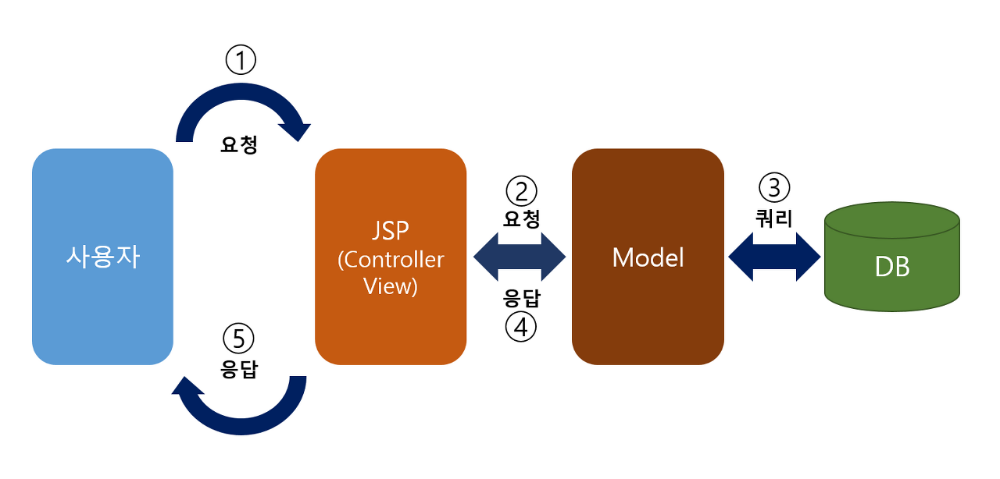
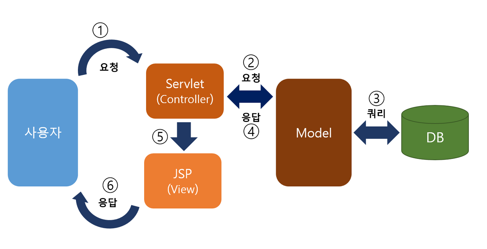

> ###  [스프링 MVC 1편 - 백엔드 웹 개발 핵심 기술](https://www.inflearn.com/course/%EC%8A%A4%ED%94%84%EB%A7%81-mvc-1/dashboard)을 기초로 하여 정리하였음


<br>
<br>

# **MVC 패턴**

## **MVC 패턴 - 개요**

MVC패턴이 나오게 된 이유

- **너무 많은 역할**
    - 서블릿이나 JSP처럼 비즈니스 로직과 뷰렌더링 부분을 모두 처리하는건 너무 많은 역할을 부여하는 것이며, 코드 수가 길어지고 유지보수가 힘들어 진다.

- **변경의 라이프 사이클**
    - 비즈니스 로직의 변경과 UI 변경이 다르게 발생하는데 하나의 코드로 관리하는것은 유지보수 하기 좋지 않다. 

- **기능 특화**
    - JSP 같은 뷰 템플릿은 화면을 렌더링 하는데 최적화 되어 있기 때문에 이 업무만 담당하게 하는것이 효율 적이다.

## **Model View Controller**
서블릿이나 JSP로 한번에 처리하던 것을 컨트롤러와 뷰라는 영역으로 역할을 나눈것

보통 웹애플리케이션은 MVC패턴을 사용한다.

- **컨트롤러**
```
HTTP 요청을 받아서 파라미터를 검증하고, 비즈니스 로직을 실행한다. 그리고 뷰에 전달할 결과 데이터를 조회해서 모델에 담는다.
```
- **모델**
```
뷰에 출력할 데이터를 담아둔다. 뷰가 필요한 데이터를 모두 모델에 담아서 전달해주는 덕분에 뷰는
비즈니스 로직이나 데이터 접근을 몰라도 되고, 화면을 렌더링 하는 일에 집중할 수 있다.
```
- **뷰**
```
모델에 담겨있는 데이터를 사용해서 화면을 그리는 일에 집중한다. 여기서는 HTML을 생성하는 부분을 말한다.
```

---
## MVC 모델1
```
JSP가 뷰와 컨트롤러의 역할을 모두 감당한다.
```


- JSP에 JAVA코드와 HTML, CSS가 섞여 소스가 복잡해지고 유지보수가 힘들다.
- 하지만 상대적으로 설계가 간단, 개발 속도가 빠르고 작은 프로젝트에 알맞음.

## MVC 모델2

모델 1에서 유지보수가 힘들다는 단점을 보완하기 위해 나온 모델이다.

기존에 뷰와 컨트롤러의 역할을 모두 수행하던 JSP는 뷰의 역할만 하게 하고, 대신 컨트롤러 역할을 Servlet이 수행한다.



- Html과 Java 코드가 분리되어 확장에 용이하고 유지보수가 수월해진다.
- 초기 설계단계에 비용이 많이 들어 개발 시간이 오래 걸린다는 단점이 있다.

```
강의에서의 모델과 위 그림에서의 모델은 다른 의미인듯 하다. 

강의에서의 모델은 뷰에 전달하는 코드상의 model 객체의 역할인것 같고, 
위 사진의 모델은 비즈니스 로직을 수행하고, DB에 접근하는 개념상의 모델인것 같다.
```


> 참고 : https://onejuny.tistory.com/entry/JavaJsp-MVC-1-MVC-2-%EC%B0%A8%EC%9D%B4-%EB%B0%8F-%EC%9E%A5%EB%8B%A8%EC%A0%90

---
