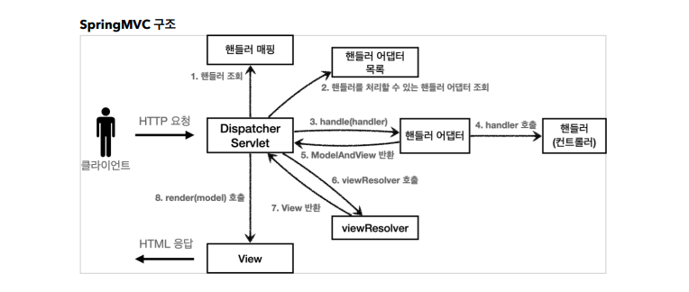

> ###  [스프링 MVC 1편 - 백엔드 웹 개발 핵심 기술](https://www.inflearn.com/course/%EC%8A%A4%ED%94%84%EB%A7%81-mvc-1/dashboard)을 기초로 하여 정리하였음


<br>
<br>

# **스프링 MVC**

## 스프링 MVC 전체 구조 



## DispacherServlet

**스프링MVC의 프론트 컨트롤러가 Dispatcher Servlet.**
 
```
스프링 부트는 톰켓이 로딩 될 때 DispatcherServlet을 서블릿으로 등록 하면서
모든 url경로 (urlPatterns="/")에 실행되게끔 매핑 된다.
```
- 더 자세한 경로로 등록한 서블릿이 있다면 더 자세한 경로가 우선시 된다.


## 동작 순서 

1. 핸들러 조회: 핸들러 매핑을 통해 요청 URL에 매핑된 핸들러(컨트롤러)를 조회한다.
2. 핸들러 어댑터 조회: 핸들러를 실행할 수 있는 핸들러 어댑터를 조회한다.
3. 핸들러 어댑터 실행: 핸들러 어댑터를 실행한다.
4. 핸들러 실행: 핸들러 어댑터가 실제 핸들러를 실행한다.
5. ModelAndView 반환: 핸들러 어댑터는 핸들러가 반환하는 정보를 ModelAndView로 변환해서
반환한다.
6. viewResolver 호출: 뷰 리졸버를 찾고 실행한다.
- JSP의 경우: InternalResourceViewResolver 가 자동 등록되고, 사용된다.
7. View 반환: 뷰 리졸버는 뷰의 논리 이름을 물리 이름으로 바꾸고, 렌더링 역할을 담당하는 뷰 객체를 반환한다.
- JSP의 경우 InternalResourceView(JstlView) 를 반환하는데, 내부에 forward() 로직이 있다.
8. 뷰 렌더링: 뷰를 통해서 뷰를 렌더링 한다.

> 뷰리졸버, 뷰는 인터페이스로 되어 있고 JSP, 타임리프마다 구현체가 다르다.

## 핸들러 매핑과 핸들러 어댑터

### **핸들러 매핑**
```
핸들러 매핑 우선순위(생략 많이 되어 있음)

0 = RequestMappingHandlerMapping : 애노테이션 기반의 컨트롤러인 @RequestMapping에서 사용

1 = BeanNameUrlHandlerMapping : 스프링 빈의 이름으로 핸들러를 찾는다.

생략...
```
핸들러(컨트롤러)를 찾기 위해 핸들러 매핑을 위의 우선순위 대로 실행한다.

- 0순위인 @RequestMapping에서 찾지 못하면 1순위인 Bean의 이름으로 핸들러를 찾음.

### **핸들러 어댑터**
```
핸들러 어댑터 우선순위(생략 많이 되어 있음)

0 = RequestMappingHandlerAdapter : 애노테이션 기반의 컨트롤러인 @RequestMapping에서 사용

1 = HttpRequestHandlerAdapter : HttpRequestHandler 처리

2 = SimpleControllerHandlerAdapter : Controller 인터페이스(애노테이션X, 과거에 사용) 처리
```
핸들러 매핑으로 찾은 핸들러를 지원하는 어댑터를 우선순위 순서대로 실행하며 찾는다.

> 실무에선 대부분 핸들러 매핑, 핸들러 어댑터 전부 RequestMapping핸들러 매핑, 핸들러 어댑터를 사용한다.

## 뷰 리졸버

핸들러 어댑터에서 찾은 논리적인 뷰 이름으로 뷰 리졸버를 순서대로 호출한다.

Spring boot가 자동으로 등록하는 뷰 리졸버
```
1 = BeanNameViewResolver : 빈 이름으로 뷰를 찾아서 반환한다. (예: 엑셀 파일 생성 기능에 사용)

2 = InternalResourceViewResolver : JSP를 처리할 수 있는 뷰를 반환한다.
```

```
EX) 핸들러 어댑터에서 찾은 뷰 이름이 'temp-view'라면 
1. 'temp-view'라는 빈 이름의 뷰가 있는지 확인 
2. 없으면 InternalResourceViewResolver를 호출한다.  
(forward()를 사용 해야하는 JSP의 경우)
3. 뷰리졸버가 뷰를 반환  // InternalResourceView
4. view.render()가 호출되고 InternalResourceView는 forward()를 사용해서 JSP실행 
```
> 다른 뷰 템플릿은 InternalResourceViewResolver를 사용하지 않는다.

> 타임리프의 경우 ThymeleafViewResolver 구현체를 사용


