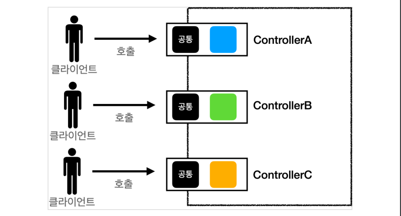
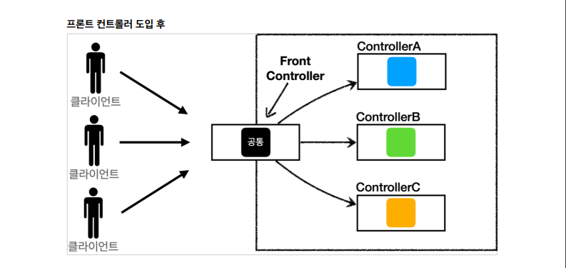

> ###  [스프링 MVC 1편 - 백엔드 웹 개발 핵심 기술](https://www.inflearn.com/course/%EC%8A%A4%ED%94%84%EB%A7%81-mvc-1/dashboard)을 기초로 하여 정리하였음

 
 

## **프론트 컨트롤러 패턴**

### 프론트 컨트롤러 도입 전

- 여러 곳에서 호출 이 들어 올 수 있다.

### 프론트 컨트롤러 도입 후

- 요청이 한곳에 집중 된다.

- FrontController 패턴 특징
    - 프론트 컨트롤러 서블릿 하나로 클라이언트의 요청을 받음
    - 프론트 컨트롤러가 요청에 맞는 컨트롤러를 찾아서 호출
    - 입구를 하나로!
    - 공통 처리 가능
    - 프론트 컨트롤러를 제외한 나머지 컨트롤러는 서블릿을 사용하지 않아도 됨
    - 스프링 웹 MVC의 DispatcherServlet이 FrontController 패턴으로 구현되어 있음

