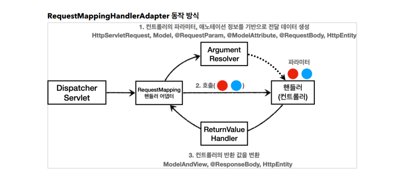
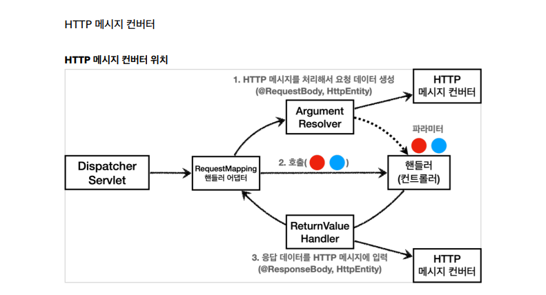

> ###  [스프링 MVC 1편 - 백엔드 웹 개발 핵심 기술](https://www.inflearn.com/course/%EC%8A%A4%ED%94%84%EB%A7%81-mvc-1/dashboard)을 기초로 하여 정리하였음


<br>
<br>

애노테이션 기반의 컨트롤러는 매우 다양한 파라미터를 사용 할 수 있다. 
> ex. HttpServletRequest, Model, @RequestParam, @ModelAttribute ...



## **ArgumentResolver**

```
애노테이션 기반의 컨트롤러를 처리하는 RequestMappingHandlerAdapter는 
ArgumentResolver를 호출 해서 컨트롤러가 필요하는 파라미터 값을 생성 한다.
그리고 파라미터 값이 모두 준비가 되면 컨트롤러(핸들러)를 호출하면서 값을 넘겨 준다.
```

### 동작 방식 

1. ArgumentResolver의 supportsParameter()를 호출해서 해당 파라미터를 지원하는지 체크
2. 지원하면 resolveArgument()를 호출해서 실제 객체를 생성한다. 
3. 이렇게 생성된 객체가 컨트롤러 호출 시 넘어 간다.

## **ReturnValueHandler**

ArgumentResolver와 비슷하지만, 컨트롤러의 응답 값을 처리해주는 인터페이스

---


- 메시지 컨버터는 Argument Resolver, Return Value Handler가 사용한다.

```
요청일때 
1. 컨트롤러의 파라미터에 @RequestBody, HttpEntity가 있다.
2. 해당 파라미터의 값을 생성해주는 Argument Resolver를 찾는다.
3. Argument Resolver의 resolveArgument() 메소드를 이용해 값을 생성 한다.
4. HTTP메시지 컨버터 우선순위에 맞는 HTTP 메시지 컨버터를 찾아 처리한다.
```
```
ArgumentsResolver, ReturnValueHandler가 동작 할때 
HTTP 바디에 직접 메시지를 읽거나 쓰는 @RequestBody, @ResponseBody, HttpEntity일 경우
메시지 컨버터가 동작 하는 것
```
- WebMvcConfigurer를 확장하여 ArgumentsResolver, ReturnValueHandler, HttpMessageConverter의 기능을 확장 할 수 있다.


# **HTTP 메시지 컨버터**

요청이나 응답이 다음과 같을때 HTTP 메시지 컨버터 동작한다.

- HTTP 요청 : @RequestBody, HttpEntity(RequestEntity)
- HTTP 응답 : @ResponseBody, HttpEntity(ResponseEntity)

HttpMessageConverter 인터페이스는 아래와 같이 구성되어 있음.
- boolean canRead(Class<?> clazz, @Nullable MediaType mediaType);
- boolean canWrite(Class<?> clazz, @Nullable MediaType mediaType);
- read(), write()
```    
canRead(), canWrite()로 해당 클래스, 미디어타입을 지원하는지 체크 한 후 
read(), write()로 메시지를 읽고 쓴다
```

스프링 부트 기본 메시지 컨버터 우선순위
```
0 = ByteArrayHttpMessageConverter
1 = StringHttpMessageConverter
2 = MappingJackson2HttpMessageConverter

일부 생략 
```

1. ByteArrayHttpMessageConverter : byte[] 데이터를 처리한다.
    - 클래스 타입: byte[] , 미디어타입: \*/\* ,
    - 요청 예) @RequestBody byte[] data
    - 응답 예) @ResponseBody return byte[] 쓰기 미디어타입 application/octet-stream

```
메시지 바디의 바이트 코드를 그대로 받는다.
클래스 타입이 byte[]일때, 어떤 미디어 타입이든 동작한다.
byte[]타입으로 응답시 미디어타입 application/octet-stream으로 자동 세팅 된다.
```

2. StringHttpMessageConverter : String 문자로 데이터를 처리한다.
    - 클래스 타입: String , 미디어타입: \*/\*
    - 요청 예) @RequestBody String data
    - 응답 예) @ResponseBody return "ok" 쓰기 미디어타입 text/plain
```
String일때 어떤 미디어 타입이든 String으로 처리
```
3. MappingJackson2HttpMessageConverter : application/json
    - 클래스 타입: 객체 또는 HashMap , 미디어타입 application/json 관련
    - 요청 예) @RequestBody HelloData data
    - 응답 예) @ResponseBody return helloData 쓰기 미디어타입 application/json 관련
```
객체 또는 HashMap이여도 미디어 타입 application/json이 아니면 동작 안함.
```

