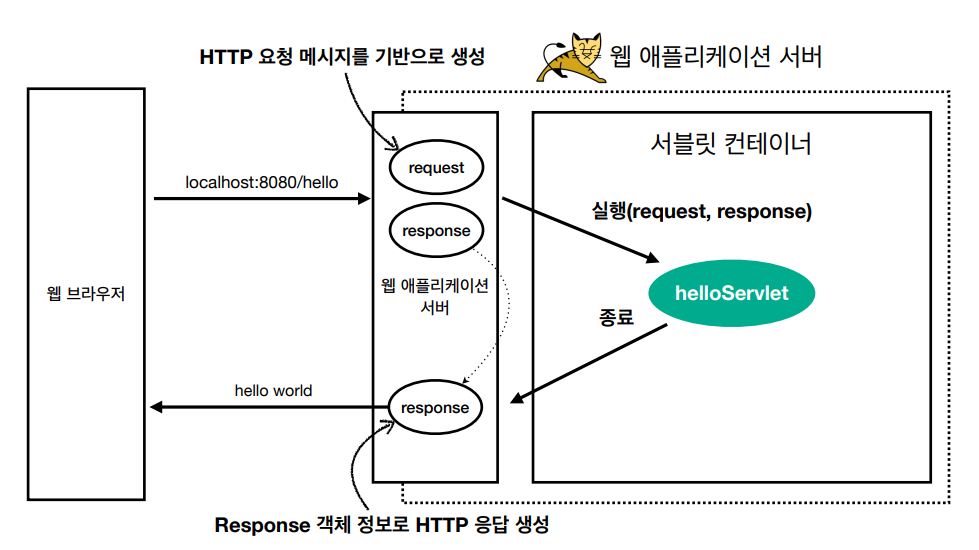

> ###  [스프링 MVC 1편 - 백엔드 웹 개발 핵심 기술](https://www.inflearn.com/course/%EC%8A%A4%ED%94%84%EB%A7%81-mvc-1/dashboard)을 보고 정리

<br>
<br>

# **웹 서버, 웹 애플리케이션 서버**

웹은 HTTP 프로토콜을 기반으로 전송 
- 거의 모든 형태의 데이터를 HTTP로 전송 가능 
- 서버간에 통신에도 대부분 HTTP 사용

## 웹 서버 (Web Server)
웹서버는 주로 정적 리소스를 제공 하는 역할
> 정적 리소스 : HTML, CSS ,JS, 이미지, 영상 등 변하지 않는 파일 

> EX) NGINX, APACHE

## 웹 애플리케이션 서버 (WAS - Web Application Server)
웹 서버 기능 + 프로그램 코드 실행하여 애플리케이션 로직 수행 동적으로 데이터를 제공  
- 동적 HTML, HTTP API(JSON)
- 서블릿, JSP, 스프링 MVC

> EX) Tomcat, Jetty, Undertow

### 웹서버와 WAS의 차이 
```
웹 서버는 정적 리소스 파일, WAS는 애플리케이션 로직 실행 

자바는 서블릿 컨테이너 기능을 제공하면 WAS로 판단했지만, 
요즘은 서블릿 없이도 자바코드를 실행하는 서버 프레임워크가 있어서 
WAS는 웹 서버에 비해 애플리케이션 코드를 실행하는데 더 특화 되어 있다고 보면 된다.
```

### 웹 시스템 구성 - WAS, DB 
WAS가 정적리소스, 애플리케이션 로직 실행하는 역할을 전부 담당하면 서버 과부하 우려
- WAS에 도달하기도 전에 장애 발생 시 오류화면 조차 전달할 수 없음.

### 웹 시스템 구성 - WEB Server, WAS, DB 
- 정적 리소스는 Web Server가 처리
- Web Server에서 동적 처리 필요 시 WAS에 요청 
- WAS 는 애플리케이션 로직 처리를 전담 

### WEB Server와 WAS를 같이 구성할 때의 장점 
```
- WAS와 웹서버의 업무를 분담 할 수 있다.
- 정적 리소스나 애플리케이션 리소스가 많이 사용 될 떄 용도에 맞는 WAS나 WEB Serve를 증설 가능
- WAS나 DB 장애시 WEB Server가 오류 화면 제공 가능
```
API만 제공하는 경우 웹서버가 없어도 된다.

# **서블릿**


```
HTTP 요청을 처리하기 위한 웹 애플리케이션 서버를 직접 구현한다면
위와 같이 TCP/IP연결 부터 클라이언트에 응답을 전달하고 소켓을 종료하는 과정 까지 비즈니스 로직 을 제외한 
많은 전, 후 과정을 작성해야 하고 항상 이 전, 후 과정을 작성하는건 매우 비효율적이다.
```

> **서블릿을 지원하는 WAS를 사용하면 초록색 부분, 즉 비즈니스 로직 부분을 제외한 전, 후 과정을 지원해준다.**

---


- urlPatterns(/hello)의 URL이 호출되면 서블릿 코드가 실행
- HTTP 요청 정보를 편리하게 사용할 수 있는 HttpServletRequest
- HTTP 응답 정보를 편리하게 제공할 수 있는 HttpServletResponse
- 개발자는 HTTP 스펙을 매우 편리하게 사용



- HTTP 요청시
    - WAS는 Request, Response 객체를 새로 만들어서 서블릿 객체 호출
    - 개발자는 Request 객체에서 HTTP 요청 정보를 편리하게 꺼내서 사용
    - 개발자는 Response 객체에 HTTP 응답 정보를 편리하게 입력
    - WAS는 Response 객체에 담겨있는 내용으로 HTTP 응답 정보를 생성

> 	Request, Response 객체는 요청이 올때마다 항상 새로 생성되고, 서블릿 객체는 싱글톤으로 재사용함. 


### **서블릿 컨테이너**

- 톰캣처럼 서블릿을 지원하는 WAS를 서블릿 컨테이너라고 함
- 서블릿 객체는 싱글톤으로 관리
- **동시 요청을 위한 멀티 쓰레드 처리 지원**


