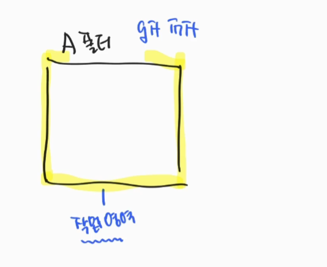
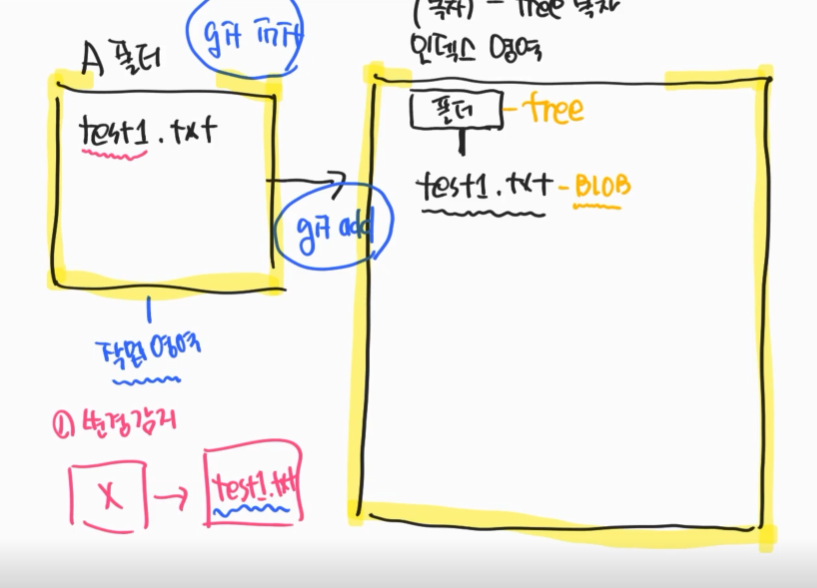
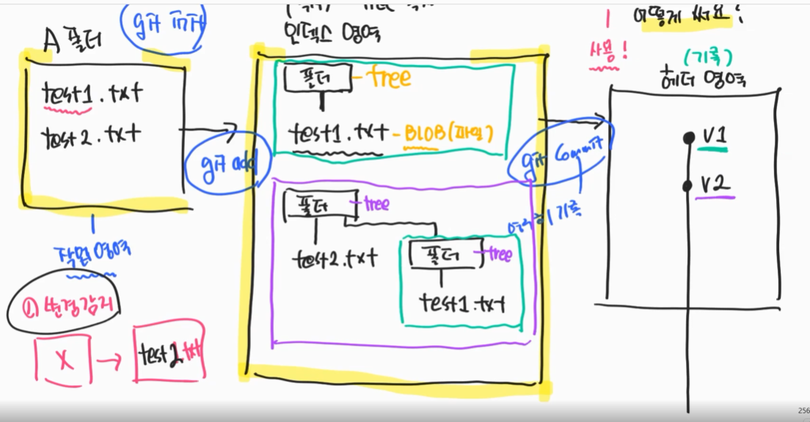
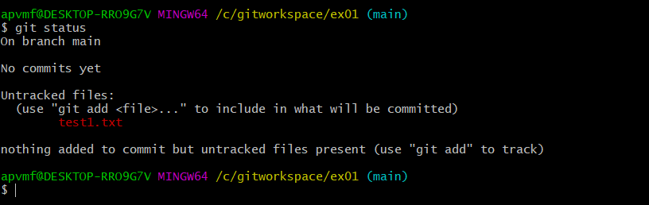
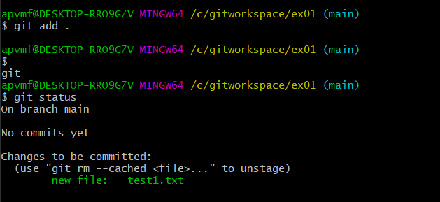

## Git 3가지 영역
- git은 `작업영역`, `인덱스영역`, `헤더영역`으로 나뉜다.

### 1. 작업 영역

```
git init
```
- 해당 폴더를 `작업영역(working directory)`으로 만드는 명령어
- 특정 폴더에서 `git init`명령을 실행 하면 `해당 폴더를 작업 영역`으로 만든다.
- `.git`이라는 숨김폴더가 생성된다.
---
GIT은 이 작업 영역에서 발생하는 일을 `변경 감지` 한다.

### 2. 인덱스영역
- 변경감지를 기록하는 영역을 인덱스 영역이라고 한다.
- Tree구조로 되어 있다.


```
git add .       // 추가된 모든 파일 변경 감지하겠다.
git add {파일}  //특정 파일을 변경감지 하겠다.
```
- git add 명령어를 통해 특정 파일의 변경을 감지하겠다고 지정할 수 있다.
- 파일은 BLOB형태로 되어있다.

---
인덱스 영역을 영구히 기록하고 싶으면, 헤더영역에 저장한다.

### 3. 헤더영역



- 인덱스 영역의 트리형태를 그대로 가져와서 영구히 기록한다. 

* ex) test2.txt를 추가 한 후 git add를 하면 인덱스 영역에 기존 트리의 해쉬값을 포함하는 새로운 트리가 만들어진다.
  * 그림은 물리적으로 들고있는 것처럼 보이지만 실제로는 해쉬값을 가지고 있다.
  * 새로 만들어진 트리를 commit하면 헤더영역에 새롭게 저장된다.
```
git commit -m "커밋메시지"
```
- 헤더영역에 영구히 기록하는 명령어
- 처음 커밋할때는 `user.name`, `user.email`을 설정해줘야 한다.

--- 
### 기타 명령어
1. git status
```
git status
```
- 변경 감지된 파일을 확인하기 위한 명령어



- git add 되기전 변경감지가 되고 있지 않은 파일은 위와 같이 빨간색으로 표시된다.
  - 파일이 언트랙 되었다.
  

- git add 되고 난 후 변경감지가 되고 있는 파일은 위와 같이 초록색으로 표시된다.

2. git config --list
- git 의 config 설정을 확인할 수 있다.

3. git log
```
git log
```
- 헤더 영역에 기록된 log를 볼 수 있다.

