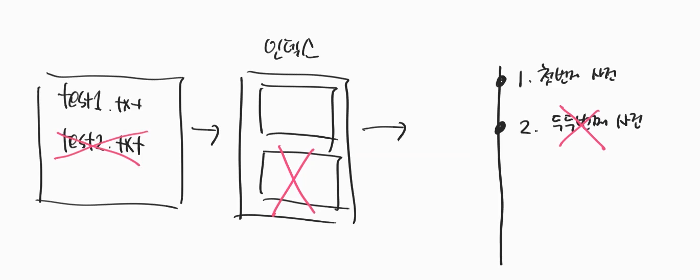

### git reset
reset명령어로 이전 상태로 되돌아 갈 수 있다. <br>

reset에는 3가지 옵션이 있다.
1. hard
2. mixed
3. soft

```java
git reset --{옵션} {해쉬ID}
```
- 위와 같이 사용하며, 되돌아갈 상태의 해쉬 값과 옵션을 지정해줘야 한다.
---
```
-시나리오-
현재 test1.txt파일을 git add 후 커밋, test2.txt파일도 git add 후 커밋한 상태이며,
reset명령어를 통해 특정 시점으로 되돌아 가려 한다. 
```
### 1.hard 옵션

- 해당 상태로 완전히 되돌아간다.
- `작업영역`, `인덱스영역`, `헤더영역`에서 전부 사라진다.
- 파일도 사라지기 때문에, 위험한 옵션
  
### 2.mixed 옵션

- `인덱스 영역`과 `헤더영역`에서만 사라진다.
  - 파일은 그대로 남아있으며, git add하기 전 상태 
  - git add하면 다시 인덱스가 만들어 진다.
- 작업 영역의 내용을 변경할때 사용
  > 그러나 이경우, 보통 새로운 커밋로그를 남기기 때문에 잘사용하지 않는다.

### 3. soft 옵션

- `헤더 영역`만 사라진다.
- Head는 자동으로 전 커밋을 바라보고 있다.
- 커밋메시지만 변경 하거나 할때 사용

### git reflog
```
만약 --hard 옵션으로 파일을 완전히 지웠을때, 복구 하고 싶다면?
```
- git reflog를 이용한다.
  - git은 한번이라도 commit하면 `reflog`에 기록이 남게 된다.

```java
git reflog
```  

- git reflog명령어를 사용하면 위와 같이 모든 커밋내역이 출력된다.
- 되돌아갈 해쉬값을 기억

- `git reset --hard {해쉬값}`명령어로 해당 시점으로 되돌아갈 수있다.
- `git log`명령어로 확인
  - `--hard명령어`로 삭제했던 해당 시점의 파일까지 복구가 되었다.

### amend옵션
```
reset 명령어로 되돌아갈 커밋로그가 없다면?   
```
- git amend명령어를 사용하여 최신 커밋을 변경 할 수있다.
```
git commit --amend -m "{커밋메시지}"
```
