### 브랜치(Branch)란?
- 개발을 하다보면 코드를 여러 개로 복사할 일이 생긴다. 코드를 통째로 복사하고 원래 코드와 별개로 독립적으로 개발하는 것
- 기존에 저장한 파일을 master 브랜치에 유지하면서 독립적으로 기존 파일 내용을 수정하거나 새로운 파일을 추가하고 스테이징, 커밋할 수 있다.

> HEAD : HEAD는 현재 브랜치를 가리키는 포인터고, 브랜치는 브랜치에 담긴 커밋 중 가장 마지막 커밋을 가리킨다.

### 브랜치 관련 명령어 
- `git branch` : 현재 저장소의 브랜치 확인
- `git branch {브랜치명}` : 브랜치 생성
- `git checkout {브랜치명}` : 해당 브랜치로 이동
- `git checkout -b {브랜치명}` : 브랜치 생성 + 브랜치 이동
- `git merge {브랜치명}` : 현재 브랜치에서 {브랜치명}의 브랜치를 가져와 병합

### Fast-forward merge 이해
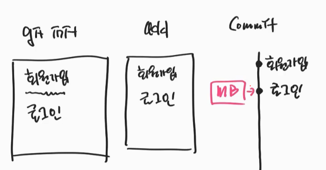
```
-시나리오-
로그인 파일을 커밋하였으며,
위와같이 Main브런치 포인터가 로그인을 가리키고 있다. 
```
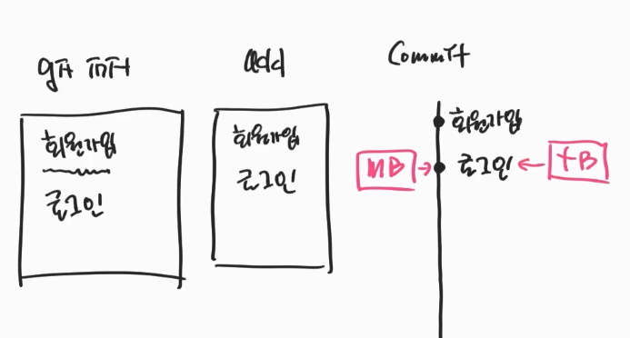
- topic 브랜치 생성
  - topic 브랜치 포인터도 `로그인`을 가리킨다.

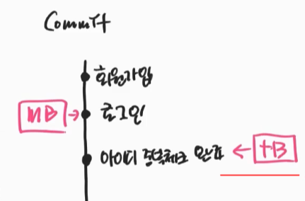
- topic 브랜치에서 `아이디 중복체크 완료`를 커밋
- topic 브랜치 포인터가 위와 같이 `아이디 중복체크 완료`로 이동 한다.

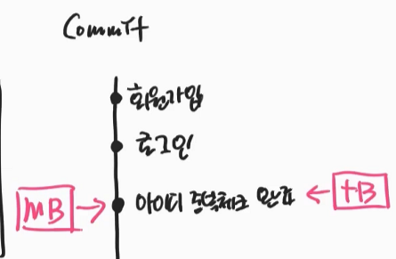
- main 브랜치로 체크아웃 후 `git merge topic` 명령어를 사용하여 병합한다.
  - 위와 같이 main 브랜치 포인터가 `아이디 중복체크 완료`로 이동 한다.
  
### Fast-forward merge 정리
- main 브랜치에서 추가작업을 하지않아 병합할 지점이 2개 밖에 없을때 수행되는 병합이다.
- 병합이라기 보다는 포인터를 옮기기만 하면된다.
  - 그래서 이름이 Fast-forword인것 같다.
---

### 3-way merge 이해
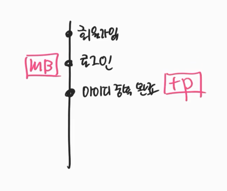
```
-시나리오-
topic브랜치를 만들어 main브랜치와는 다른 새로운 커밋을 추가하였다. 
```

- main 브랜치에서 `글쓰기`를 추가하였다.
  - main 브랜치 포인터가 `글쓰기`로 이동
- Fast-forward merge처럼 main 브랜치의 포인터만 이동하여 해결할 수없다.
  - main 브랜치의 포인터를 `아이디 중복 완료`로 이동하면, main 브랜치의 `글쓰기`가 없어지기 때문에.

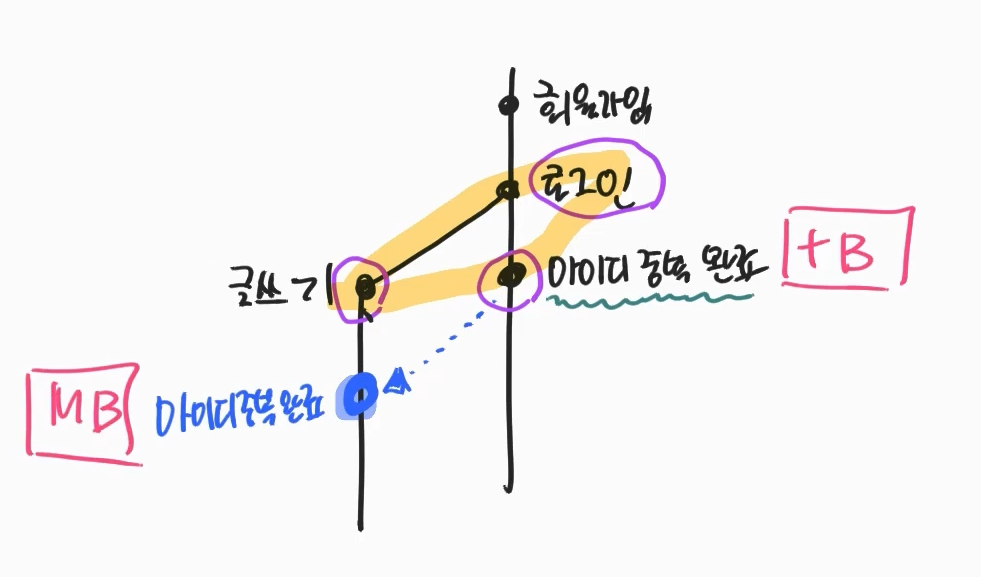
- topic 브랜치를 main 브랜치에 병합 한다.
  - main 브랜치에서 `git merge topic`명령어 이용
- 위와 같이 병합할 지점이 3개일때 3-way merge를 이용한다.
  - `로그인` : 두 브랜치의 공통부분
  - `글쓰기` : main 브랜치의 최신 커밋
  - `아이디 중복 완료` : topic 브랜치의 최신 커밋

---
### merge 충돌
merge시 충돌이 발생할 경우 어떻게 해야할까? <br>
```
-시나리오-
main 브랜치와 topic 브랜치에서 같은 파일을 수정 후
main 브랜치로 머지하는 경우 conflict 발생한다.
충돌이 발생하는 경우를 실습해보자.
```

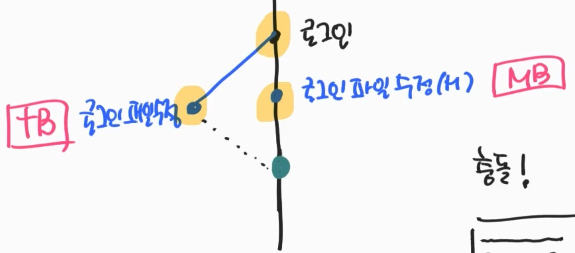

```
(main 브랜치)
touch 로그인.txt
git add . 
git commit -m "로그인"
git checkout -b topic
```
- main 브랜치에 로그인.txt파일을 생성 후 topic 브랜치 생성
```
(topic 브랜치)
파일 수정
git add .
git commit -m "로그인 체크 박스"
```
- topic 브랜치에서 파일 수정 후 커밋
  - 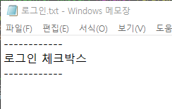
  - 위와 같이 수정 하였음
  
```
(main 브랜치)
git checkout main
파일 수정
git add .
git commit -m "로그인 체크박스"
```
- main 브랜치로 이동 후 파일 수정
  - 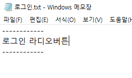
  - 위와 같이 수정 하였음.

```
(main 브랜치)
git merge topic
```
- main 브랜치에서 topic 브랜치를 merge하면 Conflict가 발생하면서, 파일내용이 변경 된다.<br>
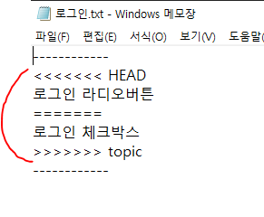
- 위와 같이 Conflict된 부분과 중복을 표시하는 3줄이 추가된다. <br> 
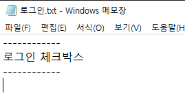
- 중복을 표시하는 3줄과 중복된 라인을 없애고, 커밋하고 싶은 부분만 남긴다.(Fix Conflict)

```
(main 브랜치)
git add .
git commit -m "로그인 체크박스 충돌 수정"
```
- 그 후 다시 커밋을 하면 충돌을 수정했다는 로그가 추가되면서, conflict가 해결된다.

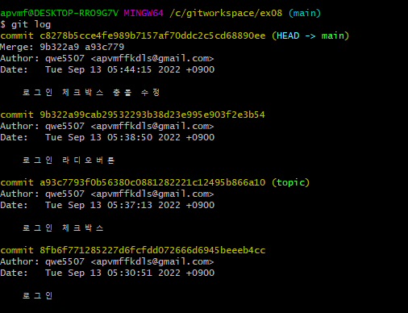
- 최종 로그를 보면 위와 같다.


---
참고
- [https://www.inflearn.com/course/%EA%B9%83-%EC%9E%85%EB%AC%B8/dashboard](https://www.inflearn.com/course/%EA%B9%83-%EC%9E%85%EB%AC%B8/dashboard)
- [https://m.blog.naver.com/PostView.naver?blogId=dktmrorl&logNo=222344170901&proxyReferer=](https://m.blog.naver.com/PostView.naver?blogId=dktmrorl&logNo=222344170901&proxyReferer=)
- [https://velog.io/@soyi47/GitGithub-%EB%B8%8C%EB%9E%9C%EC%B9%98-branch-%EA%B8%B0%EC%B4%88](https://velog.io/@soyi47/GitGithub-%EB%B8%8C%EB%9E%9C%EC%B9%98-branch-%EA%B8%B0%EC%B4%88)