### Git rebase로 로그 관리
rebase명령어로 git log를 정리 할 수 있다.
> rebase의 여러 사용방법이 있지만, 여기서는 한 브런치만 사용하였을 때 깃 로그를 정리하는 법을 배운다.

**시나리오**

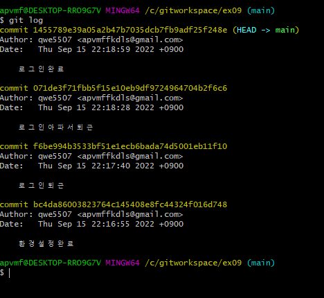
- 위와같이 커밋되어있고, 커밋 당 각 txt파일이 생성 되어 있다.
---
```
git rebase -i HEAD~3
```
- git은 `rebase의 -i옵션을 사용하여 커밋목록을 수정할 수 있다.`
- HEAD포인터를 포함하여 3개 의 커밋을 대상으로 rebase 진행하겠다.

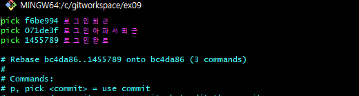
- `rebase -i`를 실행하면 위와같이 vi편집기가 실행 된다.

**1. 로그 삭제**

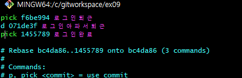

- vi 편집기에서 삭제할 로그에 d로 변경 후 저장

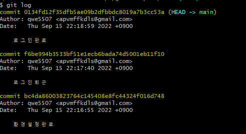

- `로그인아파서퇴근`로그가 삭제 되었다.
  - 해당 커밋 당시 생성했던 파일도 삭제된다.

**삭제한 파일을 복구하려면?**
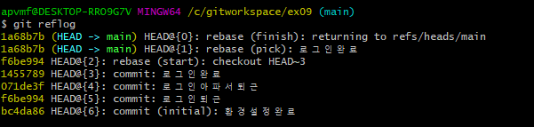
- reflog에 rebase에 대한 기록이 남아있으며, `reset --hard 명령어`로 복구 가능.

**2. 로그 변경**
> reset으로 로그 삭제 전으로 되돌아간 상태

-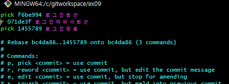
- `rebase -i`명령어 실행 후 r (reword)로 변경 후 저장

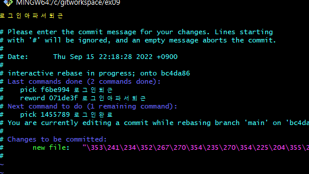
- 해당 로그를 변경할 수 있는 새로운 창이 뜬다.
- 로그 변경 후 저장

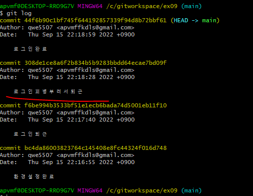
- 해당 로그메시지 변경 확인

**3. 로그 합치기**

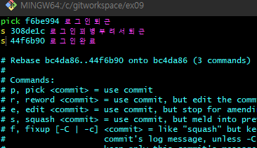
- 마찬가지로 `rebase -i`옵션 실행 
- pick할 커밋과 squash할 커밋을 지정한 후 저장
  - `합쳐질 커밋은 pick`
  - `squash(찌그러짐)당할 커밋은 s`
> pick할 커밋은 squash할 커밋보다 과거여야 한다.

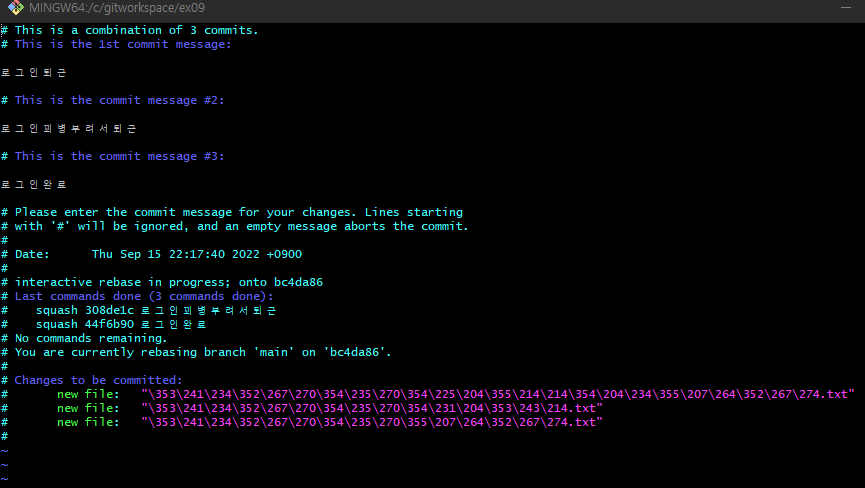
- 위와같이 합칠 커밋들이 표시 된다.

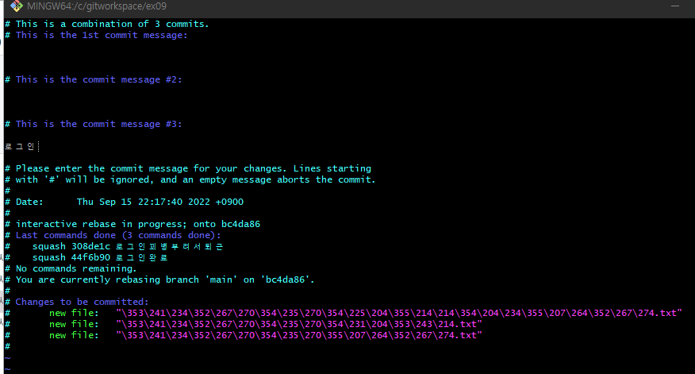
- 커밋 위와 같이 `로그인`으로 변경 후 저장

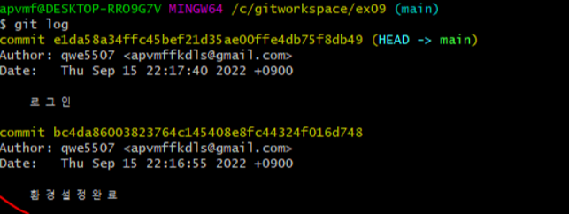
- 로그를 확인해보면 '로그인' 커밋메시지 하나로 합쳐졌다.

### rebase 주의할 점
- 깃 history를 변경하는 것이기 때문에, history를 push한 원격저장소를 사용하는 경우 꼬일 수 있다.


