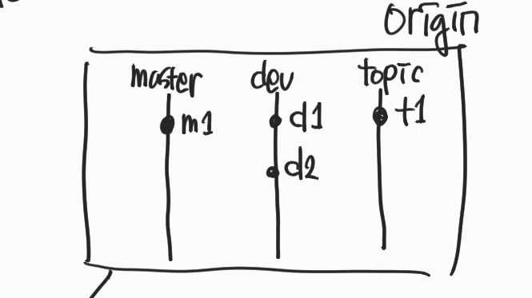
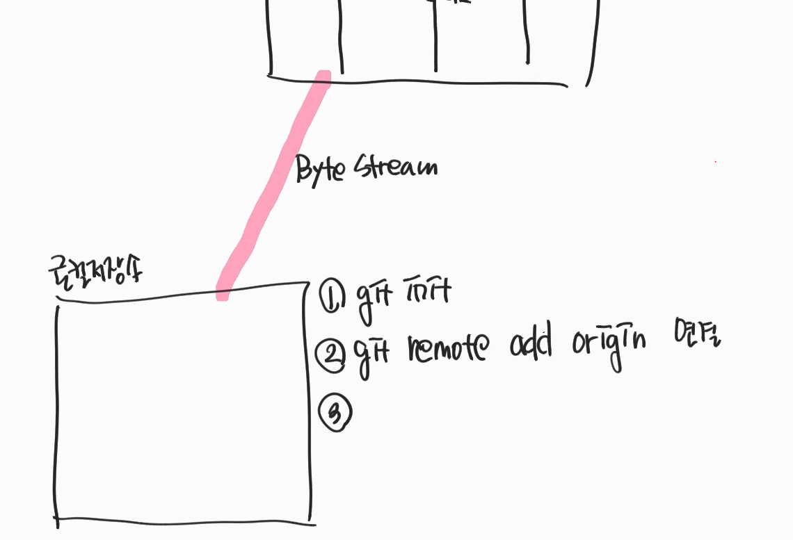
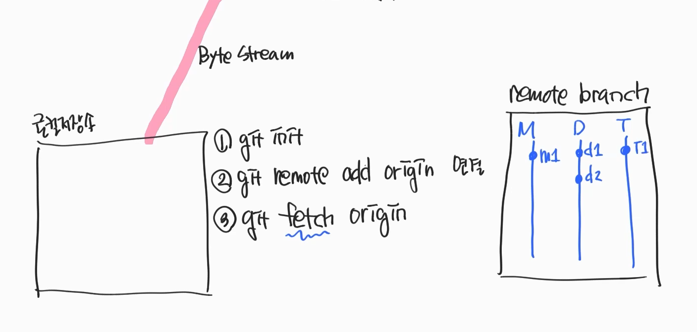
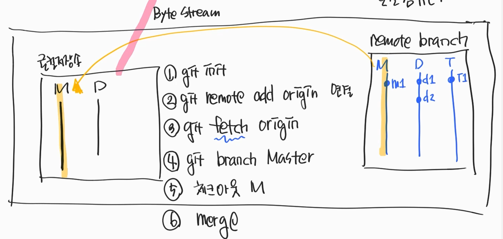
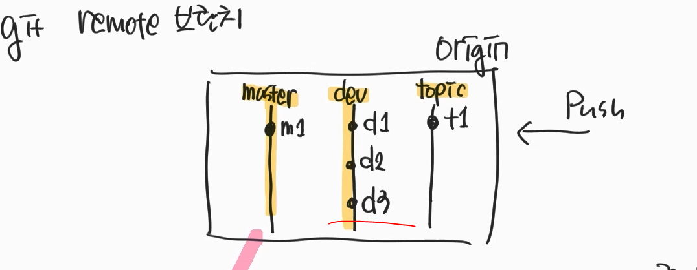
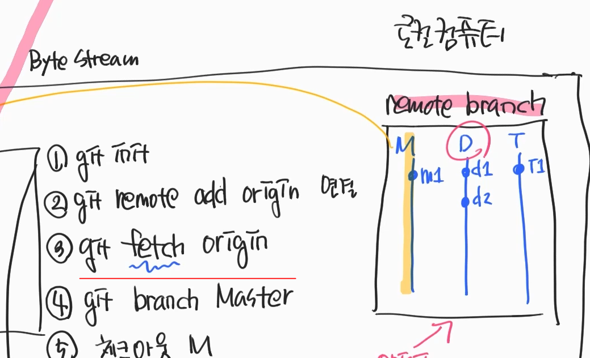

### Github remote branch

Github의 origin에 3개의 가지가 있다고 가정해보자.

Origin에 위와같이 커밋 로그가 찍혀있다.

로컬 저장소에서 `Git remote add origin` 하는 순간 선이 연결된다.
- 이 선을 byte stream이 열렸다고 한다.

이 상태에서 github origin에있는 브런치를 다운받아야 한다.

다운받는 명령어가 `git fetch origin`
- github origin에 있는 모든 브런치를 다운 받겠다.

 

**근데 현재 로컬에 브런치가 하나도 없는 상태인데 다운을 받을땐 어떻게 받아야 할까?**
- 브런치를 만들고 다운받아야 할까?
  - 그렇지 않다, remote branch라는 영역에 다운받아 진다.

- git fetch orign 했을때의 구성도 
- remote branch도 내컴퓨터 안에 존재하는 공간이다.

- 다운로드를 받은 후
  - 해당 브랜치 생성 
  - 체크아웃 
  - 병합
- 이 순서로 데이터를 동기화 할 수 있다.

 

### 실제 사용 시
- 보통은 위의 절차가 복잡하기 때문에 
- 처음 다운로드시에는 git clone을 사용하여 main 브런치를 동기화 시킨다.
- main 브런치가 아닌 다른 브런치를 동기화 시킬떄는?
  - `Git checkout -b dev origin/dev`명령어로 동기화 시킨다.
    - 생성 / 체크아웃 / 병합 을 동시에
    - 이미 github origin으로 부터 다운로드는 받아져 있을때 

### github 브런치에 추가 커밋이 발생하여 동기화 시킬때는?

- github origin에 d3라는 커밋이 추가 발생

- remote branch에 d3가 없기때문에 다운로드 필요
- `git fetch origin`
- 로컬저장소로 병합을 진행 
> remote branch에 있는 브런치는 origin/main, origin/dev, origin/topic와 같이 생성된다.

 
github에 변동사항이 있을때마다 다운로드/병합을 진행하기 힘들기 때문에  
보통은 pull을 받아 진행한다.

- pull은 해당 브런치만 fetch(다운로드)하고, 로컬브런치에 병합 시킨다.
  - pull은 한 브런치만 다운로드 한다.
  - git fetch origin은 github의 모든 브런치를 다운로드 한다. 

