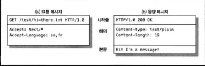
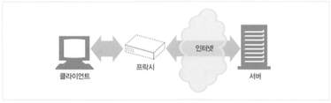
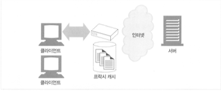
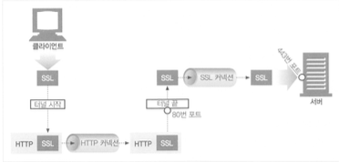
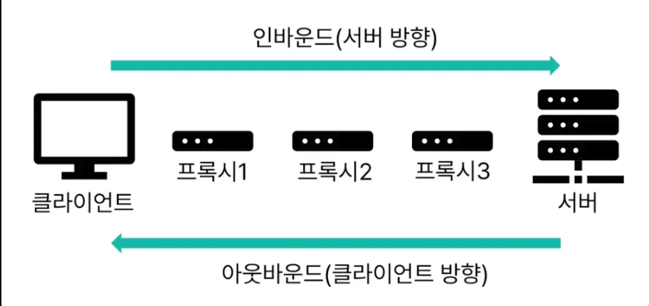

# 1부 HTTP: 웹의 기초

## 1장 HTTP 개관

**HTML**은 *HyperText Markup Language*의 약자로, 태그를 사용하여 문서의 구조와 의미를 표현하는 언어이다. **HyperText**란 문서 안에서 다른 문서로 이동할 수 있는 링크가 포함된 텍스트를 말한다.

> **HTTP**는 *HyperText Transfer Protocol*의 약자로, HyperText를 어떻게 전송할 것인지에 대한 전송 규칙을 정의한다.

초기에는 HTML 문서 공유를 위해 만들어졌지만, 현재는 이미지, 영상, 파일, JSON(API) 등 웹 리소스 전반을 전달하는 표준 프로토콜로 널리 사용된다.

---

### 1.1 HTTP: 인터넷의 멀티미디어 배달부

인터넷에는 JPEG 이미지, HTML, 텍스트 파일, MPEG 동영상, WAV 음성 파일, 자바 애플릿 등 여러 종류의 데이터가 끊임없이 오간다. HTTP는 이런 대량의 정보를 빠르고 간편하며 정확하게 웹브라우저로 옮겨주는 역할을 담당한다.

> HTTP는 **TCP 기반**의 신뢰성 있는 데이터 전송 프로토콜을 사용하므로, 데이터 손실 걱정 없이 애플리케이션 기능 구현에 집중할 수 있다.

---

### 1.2 웹 클라이언트와 서버


- **클라이언트(Client)**: 리소스를 요청하는 주체 (브라우저, 모바일 앱, API 호출자)
- **서버(Server)**: 요청을 받아 리소스를 제공하는 주체

HTTP 클라이언트와 HTTP 서버는 월드 와이드 웹의 기본 구성 요소이다.

---

### 1.3 리소스

> **리소스**란 웹에서 다루는 대상 전부를 의미한다.

HTML 문서, 이미지, 영상, 파일, API 응답(JSON) 등이 모두 리소스에 해당한다.

### 1.3.1 미디어 타입

HTTP는 모든 리소스 형식을 나타내고 구분하기 위해 **MIME Type** 라벨을 붙여 확인한다.

- `text/html`, `application/json`, `image/png`, `image/gif` 등
- MIME Type은 **주 타입**(*primary type*)과 **부 타입**(*subtype*)으로 구성된다.

---

### 1.3.2 URI

> **URI**는 *Uniform Resource Identifier*의 약자로, 리소스를 고유하게 식별하는 역할을 한다.

URI는 **URL**과 **URN** 두 가지 형태로 나뉜다.

### 1.3.3 URL

**URL**은 *Uniform Resource Locator*의 약자로, 특정 서버의 한 리소스에 대한 구체적인 위치를 서술한다. URI의 한 형태로서 리소스의 **위치 + 접근 방법**까지 포함한 식별자이다. 실무에서 "URI"라고 말해도 대부분 URL을 의미한다.

예를 들어 `http://www.oreilly.com/index.html`에서:
- `http` → **스킴(scheme)**
- `www.oreilly.com` → **인터넷 주소**
- `index.html` → **리소스**

### 1.3.4 URN

**URN**은 *Uniform Resource Name*의 약자로, 리소스의 위치에 영향받지 않는 유니크한 이름 역할을 한다. 예: `urn:isbn:0-486-27577-4`

자원의 위치가 바뀌어도 일관되게 식별할 수 있어야 하지만, 개념적으로 존재하면서도 URL보다 덜 사용된다.

> **URL vs URN**
> - URL: 리소스를 **어떻게 얻을 것이고 어디에 있는지** 명시하는 URI
> - URN: 이러한 명시 없이 **경로와 리소스 자체를 특정**하는 것을 목표로 하는 URI

---

### 1.4 트랜잭션

HTTP 트랜잭션은 **요청 1번 + 응답 1번**의 왕복으로 동작한다.

### 1.4.1 메서드

메서드는 클라이언트가 서버에게 "무엇을 할지"를 표현하는 것이다.

- **GET**: 조회
- **POST**: 처리/생성
- **PUT**: 갱신/교체
- **DELETE**: 삭제
- 그 외: HEAD, OPTIONS, TRACE 등

### 1.4.2 상태 코드

모든 HTTP 응답 메시지는 상태 코드와 함께 반환된다.

- **2xx**: 성공
- **3xx**: 리다이렉션
- **4xx**: 클라이언트 오류
- **5xx**: 서버 오류

### 1.4.3 웹페이지는 여러 객체로 이루어질 수 있다

HTML 하나만 받아서 끝나지 않고, CSS, JS, 이미지, 폰트 등 추가 리소스를 위해 **연쇄 요청**이 발생한다. 웹페이지는 하나의 리소스가 아닌 **리소스의 모음**이다.

---

### 1.5 메시지



HTTP는 단순한 줄 단위의 문자열로 구성되어 있어 사람이 읽고 쓰기 쉽다. 메시지는 **시작줄, 헤더, 본문**으로 구성되며, 헤더와 본문 사이에는 빈 줄로 구분된다.

- **시작줄**: 요청은 무엇을 해야 하는지, 응답은 무슨 일이 발생했는지
- **헤더**: 쌍점(`:`)으로 구분되어 있는 이름과 값
- **본문**: 어떤 종류의 데이터든 포함 가능 (이진 데이터 포함)

---

### 1.6 TCP 커넥션

HTTP는 **TCP** 위에서 동작한다.

> 참고로 "HTTP와 소켓 통신의 차이"라는 질문은 잘못된 질문이다. 소켓은 TCP 계층을 파일 읽기/쓰기처럼 추상화한 인터페이스이며, HTTP도 소켓을 사용한다.

### 1.6.1 TCP/IP

> **HTTP는 애플리케이션 계층 프로토콜이다.** HTTP는 네트워크 통신의 핵심적인 세부사항에 대해서 신경 쓰지 않고, 대중적이고 신뢰성 있는 인터넷 전송 프로토콜인 TCP/IP에게 맡긴다.

**TCP가 제공하는 것:**
- **오류 없는 데이터 전송**
- **순서에 맞는 전달** (데이터는 언제나 보낸 순서대로 도착한다)
- **조각나지 않는 데이터 스트림** (언제든 어떤 크기로든 보낼 수 있다)

**TCP/IP**는 TCP와 IP가 층을 이루는 **패킷 교환 네트워크 프로토콜의 집합**이다. 각 네트워크와 하드웨어의 특성을 숨기고, 어떤 종류의 컴퓨터나 네트워크든 서로 신뢰성 있는 의사소통을 하게 해 준다.

> 일단 TCP 커넥션이 맺어지면, 클라이언트와 서버 컴퓨터 간에 교환되는 메시지가 **없어지거나, 손상되거나, 순서가 뒤바뀌어 수신되는 일은 결코 없다.**

**HTTP 네트워크 프로토콜 스택:**
```
애플리케이션 계층  ← HTTP
전송 계층         ← TCP
네트워크 계층      ← IP
데이터 링크 계층
물리 계층
```

**전송 단위:**
- **TCP**: 세그먼트 단위로 전송
- **IP**: 패킷 단위로 전송

각 계층별로 캡슐화와 역캡슐화가 이루어지며, IP 계층은 전달만 담당하고 TCP가 신뢰성 있는 연결을 보장한다. 세그먼트의 시퀀스 번호를 기준으로 순서가 맞지 않으면 재전송한다.

**크기 제한:**
- **MTU** (Maximum Transmission Unit): 네트워크에서 전송 가능한 최대 패킷 크기 (이더넷 기준 1500바이트)
- **MSS** (Maximum Segment Size): TCP 페이로드의 최대 크기 (MTU - IP헤더 - TCP헤더 ≈ **1460바이트**)

따라서 HTTP 요청 데이터가 MSS(약 1460바이트)를 넘으면, HTTP 요청은 한 번이어도 내부적으로 **여러 TCP 세그먼트로 분할**되어 전송된다.

### 1.6.2 접속, IP 주소 그리고 포트번호

HTTP 전송 전에 IP와 포트번호를 사용해 TCP/IP 커넥션을 맺는다. URL을 통해 IP와 포트번호를 알아내며, 이 과정에서 **DNS**가 사용된다.

### 1.6.3 텔넷(Telnet)을 이용한 실제 예제

텔넷을 통해 텍스트 기반으로 HTTP 요청을 직접 보내보며 메시지 구조를 확인할 수 있다.

---

### 1.7 프로토콜 버전

**HTTP/1.1**이 표준이고, **HTTP/2**는 한 커넥션으로 동시에 여러 요청/응답을 할 수 있는 **멀티플렉싱**이 가능한 프로토콜이다.

> **HOL(Head-of-Line Blocking)**: keep-alive로 커넥션을 재사용해도, HTTP 요청이 느리면 다음 요청이 느려지는 현상

HTTP/1.1의 문제점:
- HOL 현상
- 헤더 중복 및 비효율

HTTP/2의 개선:
- 텍스트 기반이 아닌 **바이너리 프레임**으로 압축

**HTTP/3**은 TCP 레벨에서도 발생하는 HOL 현상과 TCP/TLS 핸드셰이크 지연을 해결하기 위해 **QUIC 프로토콜**(UDP 기반)을 사용한다. 현재 웹브라우저는 거의 기본 제공되지만, 서버는 별도 설정이 필요하다.

---

### 1.8 웹의 구성 요소

실제 웹 통신에는 중간 구성 요소가 포함될 수 있다.


- **프락시(Proxy)**: 클라이언트와 서버 사이에서 요청/응답을 대신 처리하는 중간자. 주로 보안을 위해 사용


- **캐시(Cache)**: 응답을 저장해 재사용함으로써 속도/비용 개선


- **게이트웨이(Gateway)**: 서로 다른 시스템/프로토콜을 변환하는 중간자 (예: HTTP ↔ FTP 변환)


- **터널(Tunnel)**: 데이터를 열어 보지 않고 그대로 전달하는 HTTP 애플리케이션

> **터널의 동작**: HTTP 프락시를 이용해 클라이언트가 연결을 만들고, 그 연결을 파이프처럼 써서 암호화된 TLS 트래픽을 흘려보낸다. 겉으로는 HTTP 연결처럼 보여 방화벽을 통과하지만, 내부는 TLS로 암호화된 다른 통신일 수 있다.

- **에이전트(Agent)**: 사용자를 대신해 HTTP 요청을 수행하는 클라이언트 (봇, 도구 등)

---

## 2장 URL과 리소스

### 2.1 인터넷의 리소스 탐색하기

**URL**은 **URI**의 부분집합이다. URI는 URL과 URN으로 나뉘며, URL은 스킴, 서버 주소, 리소스로 구성된다. 스킴은 HTTP가 아닌 다른 프로토콜일 수 있다.

### 2.1.1 URL이 있기 전 암흑의 시대

URL과 같은 식별 주소가 없으면 공유, 발견, 자동화가 어렵다. URL 덕분에 일관된 방식으로 리소스에 접근할 수 있게 되었다.

---

### 2.2 URL 문법

URL은 스킴에 따라 다르지만 형태와 문법이 매우 유사하다.

**URL 구성 요소:**
- **스킴(Scheme)**: 사용할 프로토콜 (`http`, `https` 등)
- **호스트(Host)**: 어느 서버인지
- **포트(Port)**: 어느 서비스로 접속할지 (기본 포트면 생략)
- **사용자 이름/비밀번호**: 스킴에 따라 요구되는 경우
- **경로(Path)**: 서버에서 리소스의 위치
- **파라미터(Parameter)**: 경로별 추가 정보
- **질의 문자열(Query String)**: `?key=value&...` 형식
- **프래그먼트(Fragment)**: `#...` 형태, 문서 내부 위치 (서버로 전송 안 됨)

**파라미터 예시:**
```
http://www.joes-hardware.com/hammers;sale=false/index.html;graphics=true
```
- `hammers` 경로: `sale=false`
- `index.html`: `graphics=true`

---

### 2.3 단축 URL

### 2.3.1 상대 URL

상대 URL은 기준 URL을 바탕으로 리소스를 참조하는 방식이다.

### 2.3.2 URL 확장

브라우저는 URL을 빠르게 입력하게 도와주는 **호스트명 확장**과 **히스토리 확장** 등의 기능을 제공한다.

---

### 2.4 안전하지 않은 문자

URL은 7비트인 **US-ASCII**로 설계되었다. 영문을 제외한 한글처럼 7비트로 표현할 수 없는 문자의 경우, **이스케이프** 기능으로 안전한 문자로 인코딩한다.

> **이스케이프**: 안전하지 않은 문자를 `%` + ASCII 코드의 16진수 2자리로 변환
> - `~` → `%7E`
> - 공백 → `%20`
> - `%` → `%25`

**예약 문자**: URL에서 특별한 의미로 사용되는 문자
- `%`: 인코딩 토큰
- `/`: 경로 구분
- `#`: 프래그먼트
- `?`: 질의
- `:`: 스킴/호스트 구분

브라우저와 같이 최초로 URL을 입력받는 애플리케이션에서 인코딩하는 것이 가장 적절하다.

---

## 3장 HTTP 메시지

이번 장은 HTTP 메시지를 어떻게 만들고 이해하는지에 대해 다룬다.

### 3.1 메시지의 흐름



- **인바운드(Inbound)**: 메시지가 서버로 향하는 것
- **아웃바운드(Outbound)**: 서버에서 처리 후 사용자 에이전트로 돌아오는 것

각 요청과 응답은 목적지에 도달할 때까지 다시 되돌아가지 않고 **한 방향**으로 흐른다.

### 3.2 메시지의 각 부분

### 3.2.1 메시지 문법

**요청 메시지:**
```
<메서드> <요청 URL> <버전>
<헤더>

<본문>
```

**응답 메시지:**
```
<버전> <상태코드> <사유 구절>
<헤더>

<본문>
```

**각 구성 요소 설명:**
- **메서드(Method)**: 서버가 리소스에 대해 수행할 동작
- **요청 URL**: 요청 대상 리소스
- **버전**: 지원하는 HTTP 버전 (가장 높은 버전)
- **상태 코드(Status Code)**: 무엇이 일어났는지 설명하는 세 자리 숫자
- **사유 구절(Reason Phrase)**: 상태 코드를 사람이 이해할 수 있도록 설명
- **헤더**: 이름:값 형태의 메시지 속성
- **본문**: 임의의 데이터 블록 (없을 수도 있음)

---

**HTTP/2 메시지 형식:**

HTTP/2는 텍스트 기반이 아닌 **바이너리 프레임** 구조를 사용한다.

```
┌─────────────────────────────────────┐
│ Frame Header (9 bytes)              │
│ - Length (3 bytes)                  │
│ - Type (1 byte)                     │
│ - Flags (1 byte)                    │
│ - Stream ID (4 bytes)               │
├─────────────────────────────────────┤
│ Frame Payload (가변)                 │
└─────────────────────────────────────┘
```

**HTTP/1.1 vs HTTP/2 비교:**

| 항목 | HTTP/1.1 | HTTP/2 |
|-----|----------|--------|
| 형식 | 텍스트 | 바이너리 |
| 헤더 | 평문 (중복 전송) | HPACK 압축 |
| 요청 | 순차 처리 | 멀티플렉싱 (동시 처리) |
| 단위 | 메시지 | 프레임 → 스트림 |

### 3.2.3 헤더

HTTP 헤더 필드는 요청/응답 메시지에 대한 추가 정보를 나타낸다.

**헤더 분류:**
- **일반 헤더**: 요청/응답 모두에 존재 가능
- **요청 헤더**: 요청에 대한 부가 정보
- **응답 헤더**: 응답에 대한 부가 정보
- **엔티티(Entity) 헤더**: HTTP 바디에 대한 정보
- **확장 헤더**: 명세에 정의되지 않은 새로운 헤더

헤더는 스페이스나 탭을 넣어 여러 줄로 쪼개 읽기 좋게 만들 수 있다.

### 3.2.4 엔티티 본문

HTTP 메시지의 본문에는 이미지, 비디오, HTML 문서, 소프트웨어, 신용카드 트랜잭션, 전자우편 등 여러 종류의 디지털 데이터를 포함한다.

### 3.2.5 버전 0.9 메시지

HTTP/0.9 메시지는 요청은 메서드와 요청 URL만, 응답은 엔티티로만 구성되어 있다.

---

### 3.3 메서드

### 3.3.1 안전한 메서드(Safe Method)

> **안전한 메서드**: 서버 상태를 바꾸지 않는 메서드 (GET, HEAD)

HTTP 요청의 결과로 서버에서 변경되는 것이 없다.

### 3.3.2 GET

리소스를 **조회**하기 위해 요청하는 메서드이다.

### 3.3.3 HEAD

GET과 유사하지만 **본문 없이 헤더만** 받는다. 클라이언트가 리소스를 실제로 가져올 필요 없이 헤더만 조사할 수 있다. 서버 개발자는 GET으로 얻는 헤더와 일치하는 것을 보장해야 한다.

### 3.3.4 PUT

새 문서를 **만들거나**, 이미 존재한다면 **교체**하는 것을 의미한다.

### 3.3.5 POST

서버에 **입력 데이터를 전송**하기 위해 설계되었다.

### 3.3.6 TRACE

요청이 경로상에서 어떻게 변하는지 **추적/진단**하는 데 사용된다. 본문에는 요청 정보만 저장되고 별도 데이터 추가 불가.

### 3.3.7 OPTIONS

서버가 지원하는 **기능과 메서드를 확인**하는 데 사용된다.

### 3.3.8 DELETE

리소스를 **삭제**하려는 의도를 나타낸다.

### 3.3.9 확장 메서드

표준 외에도 확장 메서드가 존재할 수 있다.
