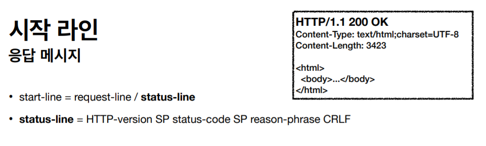

> ###  [인프런 - 모든 개발자를 위한 HTTP 웹 기본 지식](https://www.inflearn.com/course/http-%EC%9B%B9-%EB%84%A4%ED%8A%B8%EC%9B%8C%ED%81%AC/dashboard)을 보고 정리

 
 

# **HTTP(HyperText Transfer Protocol)**

> 하이퍼텍스트(Hypertext, 문화어: 초본문, 하이퍼본문)는 참조(하이퍼링크)를 통해 독자가 한 문서에서 다른 문서로 즉시 접근할 수 있는 텍스트이다. 

HTTP는 처음엔 하이퍼텍스트를 전송하는 프로토콜로 시작했지만

**지금은 모든 것을 HTTP 메시지에 담아 전송한다.**

- HTML, TEXT
- IMAGE, 음성, 영상, 파일
- JSON, XML (API)
- 거의 모든 형태의 데이터 전송 가능
- 서버간에 데이터를 주고 받을 때도 대부분 HTTP 사용
- **지금은 HTTP 시대!**

---

### HTTP의 역사
* HTTP/0.9 1991년: GET 메서드만 지원, HTTP 헤더X
* HTTP/1.0 1996년: 메서드, 헤더 추가
* **HTTP/1.1 1997년: 가장 많이 사용, 우리에게 가장 중요한 버전**
    * RFC2068 (1997) -> RFC2616 (1999) -> RFC7230~7235 (2014)
* HTTP/2 2015년: 성능 개선
* HTTP/3 진행중: TCP 대신에 UDP 사용, 성능 개선

> HTTP/1.1에 대부분의 기능이 들어있고, HTTP2,3은 성능 개선에 초점이 맞춰져있다.

- HTTP/1.1, HTTP/2는 TCP프로토콜 위에서 동작
- HTTP/3는 UDP기반으로 개발되었다.
    - 애플리케이션단에서 성능 최적화됨

개발자도구에서 Network - Protocal을 확인하면 어떤 http를 사용하는지 알 수있음.
- H2는 http2
- Http/1.1
- H3는 http3

> HTTP2,3이 급속도로 퍼지고 있다.

---
### HTTP 특징

- 클라이언트 서버 구조 
- 무상태 프로토콜, 비연결성
- HTTP메시지를 통해 전송
- 단순하고 확장가능

# **클라이언트 서버 구조**
HTTP는 클라이언트 서버 구조로 되어 있다.

- HTTP는 클라이언트가 HTTP메시지를 통해 서버에 요청을 보낸다.
- 클라이언트는 서버에서 응답이 올 떄 까지 기다린다.
- 서버가 요청에 대한 결과를 응답 

> 클라이언트와 서버를 개념적으로 분리하면 클라이언트는 UI, 사용성에 집중, 서버는 비즈니스 로직에 집중해 각각 독립적으로 진화 할 수있다.

# **Stateful, Stateless**

HTTP의 특징 중 하나는 무상태 프로토콜(Stateless)을 지향한다.

 - Stateful : 서버가 클라이언트의 상태를 기억한다.
    - 중간에 서버가 바뀌면 요청을 처음부터 다시해야 한다.

        - 에러를 방지 하려면 상태정보를 다른 서버에 알려줘야함

 

- Stateless : 서버가 클라이언트의 상태를 기억하지 않는다.
    - 서버가 클라이언트의 상태를 기억하고 있지 않기 떄문에, 서버가 필요한 정보를 그때 그떄 다 넘긴다.

    - 클라이언트 요청이 증가해도 서버를 대거 투입할 수 있다.
    - 무상태로 설계를 하면 엄청 확장성을 가진다.
    - 무상태는 상태를 보관하지 않기 떄문에 응답 서버를 쉽게 바꿀 수 있다. -> 무한한 서버 증설 가능

### 실무 한계
* 모든 것을 무상태로 설계 할 수 있는 경우도 있고 없는 경우도 있다.
* 무상태
    * 예) 로그인이 필요 없는 단순한 서비스 소개 화면
* 상태 유지
    * 예) 로그인
* 로그인한 사용자의 경우 로그인 했다는 상태를 서버에 유지
* 일반적으로 브라우저 쿠키와 서버 세션등을 사용해서 상태 유지
* 상태 유지는 최소한만 사용
* 추가로 Stateless는 데이터를 너무 많이 보낸다는 단점이 있다.

> 애플리케이션을 설계할때는 최대한 무상태로 설계한다. 어쩔수 없는 경우만 상태유지를 한다. 

# **비 연결성(connectionless)**

### **비연결성**

-  연결을 유지하는 모델일 경우 서버 자원이 계속 소모한다.
-  연결을 유지하지 않는 모델일 경우 요청, 응답 후 연결을 종료 하기 떄문에 서버가 사용하는 자원을 최소한으로 줄인다.

HTTP는 기본이 연결을 유지하지 않는 모델 -> 비연결성

-  일반적으로 초 단위의 이하의 빠른 속도로 응답
-  1시간 동안 수천명이 서비스를 사용해도 실제 서버에서 동시에 처리하는 요청은 수십개 이
하로 매우 작음
-  예) 웹 브라우저에서 계속 연속해서 검색 버튼을 누르지는 않는다.
-  서버 자원을 매우 효율적으로 사용할 수 있음

> HTTP를 주고받는 환경에선 서버의 연결을 유지하지 않는게 서버 입장에서 자원의 가용성을 높일 수 있다. 

### **한계와 극복**

- TCP/IP 연결을 새로 맺어야 함 - 3 way handshake 시간 추가
-  웹 브라우저로 사이트를 요청하면 HTML 뿐만 아니라 자바스크립트, css, 추가 이미지 등
등 수 많은 자원이 함께 다운로드
- 지금은 **HTTP 지속 연결(Persistent Connections)** 로 문제 해결
-  HTTP/2, HTTP/3에서 더 많은 최적화

- HTTP 초기에는 각 자원마다 연결, 요청, 응답, 종료를 반복했다.

- 한번 연결하고 요청,응답후 자원을 전부 받을때까지 연결을 유지했다가 종료 
	- 내부 매커니즘에 따라 몇초 기다리거나 하는건 다름 
	- 왠만한 HTML 자원을 전부 받을떄까지는 지속연결을 유지 한다. 
	
HTTP2 와 HTTP3에서는 지속연결을 더 빠르게 최적화 했음. 

### **스테이스리스를 기억하자**
서버 개발자들이 어려워하는 업무
- 정말 같은 시간에 딱 맞추어 발생하는 대용량 트래픽
- 예) 선착순 이벤트, 명절 KTX 예약, 학과 수업 등록
- 예) 저녁 6:00 선착순 1000명 치킨 할인 이벤트 -> 수만명 동시 요청

> 최대한 stateless하게 설계하면 이런 대용량 트래픽이 발생하는 경우에도 서버를 늘려 대응할 수 있다. 

# **HTTP 메시지**

HTTP메시지는 시작라인, 헤더, 공백라인, message body로 나뉜다.

- 헤더와 body사이의 공백라인은 무조건 있어야함.
- 요청 메시지와 응답메시지는 시작라인이 다르고 나머진 동일

## **시작라인**
### **요청메시지 - 시작 라인**

- 시작라인은 크게 request-line과 status-line으로 되어있다.
- 요청메시지는 request-line이다. / 응답은 status-line

> request-line은 HTTP 메서드, 요청 대상, HTTP Version으로 나뉨

**1. HTTP 메서드**

종류: GET, POST, PUT, DELETE...
- 서버가 수행해야 할 동작 지정
- GET: 리소스 조회
- POST: 요청 내역 처리

**2. 요청 대상**
- absolute-path[?query] (절대경로[?쿼리])
- 절대경로= "/" 로 시작하는 경로
- 참고: *, http://...?x=y 와 같이 다른 유형의 경로지정 방법도 있다.

**3. HTTP Version**

### **응답메시지 - 시작 라인**

> status-line라인은 HTTP 버전, HTTP상태 코드, 이유문구로 나뉨

**1. HTTP 버전**

**2. HTTP 상태 코드**: 요청 성공, 실패를 나타냄
- 200: 성공
- 400: 클라이언트 요청 오류
- 500: 서버 내부 오류

**3. 이유 문구**: 사람이 이해할 수 있는 짧은 상태 코드 설명 글

## **HTTP 헤더**

- OWS는 띄어쓰기 허용
    - Host: www.google.com은 되는데 
    - Host : www.google.com은 안된다 . //OWS가 : 다음에 있어서 
- Field-name은 대소문자 구문 없음, value는 대소문자 구분 

### HTTP헤더 용도
- **HTTP 전송에 필요한 모든 부가정보**
-  예) 메시지 바디의 내용, 메시지 바디의 크기, 압축, 인증, 요청 클라이언트(브라우저) 정보,
서버 애플리케이션 정보, 캐시 관리 정보...
- 표준 헤더가 너무 많음
    - https://en.wikipedia.org/wiki/List_of_HTTP_header_fields
- 필요시 임의의 헤더 추가 가능
    - helloworld: hihi

## **HTTP 메시지 바디**
- 실제 전송할 데이터
-  HTML 문서, 이미지, 영상, JSON 등등 **byte로 표현할 수 있는 모든 데이터 전송 가능**

## **단순함 확장 가능**
-  HTTP는 단순하다. 스펙도 읽어볼만...
-  HTTP 메시지도 매우 단순
-  크게 성공하는 표준 기술은 단순하지만 확장 가능한 기술

## **HTTP 정리**
- HTTP 메시지에 모든 것을 전송
- HTTP 역사 HTTP/1.1을 기준으로 학습
- 클라이언트 서버 구조
- 무상태 프로토콜(스테이스리스)
- HTTP 메시지
- 단순함, 확장 가능
- **지금은 HTTP 시대**

