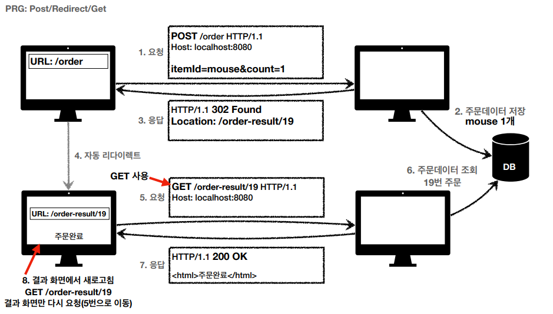

> ###  [인프런 - 모든 개발자를 위한 HTTP 웹 기본 지식](https://www.inflearn.com/course/http-%EC%9B%B9-%EB%84%A4%ED%8A%B8%EC%9B%8C%ED%81%AC/dashboard)을 보고 정리

<br>
<br>

# **HTTP 상태코드**

## **1xx (Information) : 요청이 수신되어 처리중**
> 거의 사용하지 않으므로 생략


## **2xx (Successful) : 클라이언트의 요청을 성공적으로 처리**

- 200 OK
    - 가장 일반적인 경우로 요청이 정상적으로 성공
- 201 Created
    - 요청 성공해서 새로운 리소스가 생성됨
    - 서버에서 신규 리소스를 만들고, 그 리소스 uri에대해 서버가 알고 있으면(POST 등록) 
    201로 응답후 HTTP헤더 Location에 새로생성된 리소스의 uri경로를 보내준다. 
    - 클라이언트는 201이 오면 '자원이 생성되었고 location헤더가 있을수 있겠구나!' 라고 판단한다. 

- 202 Accepted
    - 배치 처리 같은 곳에서 사용 (잘 사용 x)
    - 예) 요청 접수 후 1시간 뒤에 배치 프로세스가 요청을 처리함
- 204 No Content
    - 예) 웹 문서 편집기에서 save 버튼
    - 저장한 결과가 필요없고, 저장 되었다는 결과만 알면 될때 사용
    - save 버튼을 눌러도 같은 화면을 유지해야 한다.
    - 결과 내용이 없어도 204 메시지(2xx)만으로 성공을 인식할 수 있다.

## **3xx (Redirection) : 요청을 완료하기 위해 유저 에이전트의 추가 조치 필요**

    웹 브라우저는 3xx 응답의 결과에 Location 헤더가 있으면, Location 위치로 자동 이동 (리다이렉트)

### 영구 리다이렉션 - 특정 리소스의 URI가 영구적으로 이동
 예) /members -> /users

 예) /event -> /new-event

 - 원래의 URL를 사용X, 검색 엔진 등에서도 새로운 URL 사용해야 함

 - 301, 308 둘다 경로가 완전히 바꼇다는것을 알려주며 기능이 동일 


- **301 Moved Permanently**
    - 리다이렉트시 요청 메서드가 GET으로 변하고, 본문이 제거될 수 있음(MAY)
    - 바뀐 URI형식에 맞춰 다시 보내야 함.
	    - 등록을 위해 POST로 보냈지만 GET으로 다시 요청하기 때문에 바뀐 데이터 형식으로 다시 보내기 위해 등록폼으로 이동하거나 할것이다.

- **308 Permanent Redirect**
    - 301과 기능은 같음
    - 리다이렉트시 요청 메서드와 본문 유지(처음 POST를 보내면 리다이렉트도 POST 유지).
    - 301처럼 다시 보낼필요가 없다 
    
> 	실무에서는 요청URI이 바뀌면 폼을 그 형식에 맞춰 다시 보내는게 맞기 때문에 301을 그냥 사용한다고 한다. (둘 다 잘 사용 안함)


### **일시 리다이렉션 - 일시적인 변경**
실무에선 일시적 리다이렉션을 많이 사용

- 리소스의 URI가 일시적으로 변경
- 따라서 검색 엔진 등에서 URL을 변경하면 안됨
- 302 Found
    - **리다이렉트시 요청 메서드가 GET으로 변하고, 본문이 제거될 수 있음**(MAY)
    - (대부분 GET으로 변경되나 명확하지 않음)
- 307 Temporary Redirect
    - 302와 기능은 같음
    - **리다이렉트시 요청 메서드와 본문 유지**(요청 메서드를 변경하면 안된다. MUST NOT)
- 303 See Other
    - 302와 기능은 같음
    - **리다이렉트시 요청 메서드가 GET으로 변경**
    - (명확하게 GET으로 변경)
---
### **PRG패턴: Post/Redirect/Get**

주문요청이 중복되서 들어올 경우 POST가 최종 메서드인 경우 주문데이터가 중복 될 수 있다. 



- 위와 같이 POST요청 후 302응답으로 Location에 URI를 지정 
- 그후 응답받은 URI와 GET메서드로 리다이렉션
- 새로고침해도 GET요청만 반복된다. // 중복요청 해결 
- 그 외에도 사용자의 사용성도 좋고 서버에서 오류 발생률도 줄어든다. 
- 실무에선 서버에서도 중복 주문에대한 처리를 해줘야함.
---

**정리**

- 잠깐 정리
    - 302 Found -> GET으로 변할 수 있음
    - 307 Temporary Redirect -> 메서드가 변하면 안됨 
    - 303 See Other -> 메서드가 GET으로 변경
    - 일시적으로 전부 uri는 변경 됨
- 역사
    - 처음 302 스펙의 의도는 HTTP 메서드를 유지하는 것
    - 그런데 웹 브라우저들이 대부분 GET으로 바꾸어버림(일부는 다르게 동작)
    - 그래서 모호한 302를 대신하는 명확한 307, 303이 등장함(301 대응으로 308도 등장)
- 현실
    - 307, 303을 권장하지만 현실적으로 이미 많은 애플리케이션 라이브러리들이 302를 기본값으로 사용
    - 자동 리다이렉션시에 GET으로 변해도 되면 그냥 302를 사용해도 큰 문제 없음


### 기타 리다이렉션
- 300 Multiple Choices: 안쓴다.
- 304 Not Modified
    - 캐시를 목적으로 사용
    - 클라이언트에게 리소스가 수정되지 않았음을 알려준다. 따라서 클라이언트는 로컬PC에
저장된 캐시를 재사용한다. (캐시로 리다이렉트 한다.)
    - 304 응답은 응답에 메시지 바디를 포함하면 안된다. (로컬 캐시를 사용해야 하므로)
    - 조건부 GET, HEAD 요청시 사용
    
## **4xx (Client Error)) 클라이언트 오류**
- 클라이언트의 요청에 잘못된 문법등으로 서버가 요청을 수행할 수 없음
- 오류의 원인이 클라이언트에 있음
- 중요! 클라이언트가 이미 잘못된 요청, 데이터를 보내고 있기 때문에, 똑같은 재시도가 실
패함
- 서버 개발자는 400에 대한 처리를 철저하게 해줘야 함.

- 400 Bad Request - 클라이언트가 잘못된 요청을 해서 서버가 요청을 처리할 수 없음
    - 요청 구문, 메시지 등등 오류
    - 클라이언트는 요청 내용을 다시 검토하고, 보내야함
    - 예) 요청 파라미터가 잘못되거나, API 스펙이 맞지 않을 때

- 401 Unauthorized - 클라이언트가 해당 리소스에 대한 인증이 필요함
    - 인증(Authentication) 되지 않음 => (로그인이 되지 않음.)
    - 401 오류 발생시 응답에 WWW-Authenticate 헤더와 함께 인증 방법을 설명
    - 참고
        - 인증(Authentication): 본인이 누구인지 확인, (로그인)
        - 인가(Authorization): 권한부여 (ADMIN 권한처럼 특정 리소스에 접근할 수 있는 권한,
인증이 있어야 인가가 있음)
        - 오류 메시지가 Unauthorized 이지만 인증 되지 않음 (이름이 아쉬움)
- 403 Forbidden
    - 서버가 요청을 이해했지만 승인을 거부함
    - 주로 인증 자격 증명은 있지만, 접근 권한이 불충분한 경우
    - 예) 어드민 등급이 아닌 사용자가 로그인은 했지만, 어드민 등급의 리소스에 접근하는 경우

- 404 Not Found
    - 요청 리소스가 서버에 없음
    - 또는 클라이언트가 권한이 부족한 리소스에 접근할 때 해당 리소스를 숨기고 싶을 때

## **5xx (Server Error)) 서버 오류**
- 서버 문제로 오류 발생
- 서버에 문제가 있기 때문에 재시도 하면 성공할 수도 있음(복구가 되거나 등등)

- 500 Internal Server Error
    - 서버 내부 문제로 오류 발생
    - 애매하면 500 오류

- 503 Service Unavailable - 서비스 이용 불가
    - 서버가 일시적인 과부하 또는 예정된 작업으로 잠시 요청을 처리할 수 없음
    - Retry-After 헤더 필드로 얼마뒤에 복구되는지 보낼 수도 있음
    - 보통 서비스 이용 불가를 예측하기는 쉽지 않다. 

```
왠만하면 500을 만들면 안된다, 진짜 문제가 터졌을때 500을 만들어야 함. 

- Ex) 클라이언트 요청도 올바른데 고객의 잔고가 부족한 경우, 고객의 나이가 20살이상 이여야 하는데 아닌 경우 이러한 경우 500에러 내면 안된다.
- 500에러는 서버에 진짜 문제가 있을때 내야 한다. 
- 쿼리에 문제가 생기거나, Null포인트, 서버가 내려가거나 등등 
	- 나머지는 400으로 해결하거나 200으로 해결해야 한다. 
```

**400과 500을 차이점**

    클라이언트가 동일한 요청시
    400은  계속 실패한다.
    500은 실패하다가 나중에 서버가 복구되면 성공할 가능성이 있음.


---
### **만약 모르는 상태 코드가 나타나면?**
- 클라이언트가 인식할 수 없는 상태코드를 서버가 반환하면?
- 클라이언트는 상위 상태코드로 해석해서 처리
- 미래에 새로운 상태 코드가 추가되어도 클라이언트를 변경하지 않아도 됨
- 예)
    - 299 ??? -> 2xx (Successful)
    - 451 ??? -> 4xx (Client Error)
    - 599 ??? -> 5xx (Server Error)

> ### **이런 상태코드는 서버개발자가 직접 설정 하는것**
