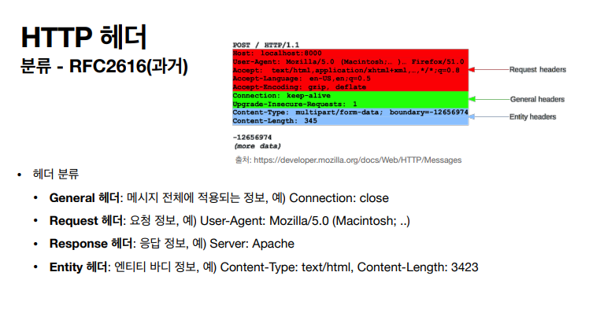
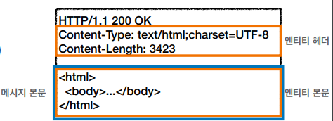

> ###  [인프런 - 모든 개발자를 위한 HTTP 웹 기본 지식](https://www.inflearn.com/course/http-%EC%9B%B9-%EB%84%A4%ED%8A%B8%EC%9B%8C%ED%81%AC/dashboard)을 보고 정리

<br>
<br>

# **HTTP 헤더 개요**

HTTP 전송에 필요한 모든 부가정보가 포함
- 예) 메시지 바디의 내용, 메시지 바디의 크기, 압축, 인증, 요청 클라이언트, 서버 정보, 캐
시 관리 정보...
- 표준 헤더가 너무 많음
- 필요시 임의의 헤더 추가 가능
    - ex) helloworld: hih

### **과거의 HTTP 헤더**


- 과거엔 헤더를 4가지로 분류
    - General 헤더: 메시지 전체에 적용되는 정보, 예) Connection: close
    - Request 헤더: 요청 정보, 예) User-Agent: Mozilla/5.0 (Macintosh; ..)
    - Response 헤더: 응답 정보, 예) Server: Apache
    - Entity 헤더: 엔티티 바디 정보, 예) Content-Type: text/html, Content-Length: 342



- 메시지 본문(message body)은 엔티티 본문(entity body)을 전달하는데 사용
- 엔티티 본문은 요청이나 응답에서 전달할 실제 데이터
- 엔티티 헤더는 엔티티 본문의 데이터를 해석할 수 있는 정보 제공
    - 데이터 유형(html, json), 데이터 길이, 압축 정보 등등
---

```
RFC2616이 폐지 되고 
2014년 RFC7230~7235 등장 하여 스펙 변경 됨 
```
**RFC723x 변화**
- **엔티티(Entity)가 표현(Representation)으로 변경**
- Representation = representation Metadata + Representation Data
- 표현 = 표현 메타데이터 + 표현 데이터

HTTP BODY // message body - RFC7230(최신)


- 메시지 본문(message body)을 통해 표현 데이터 전달
- 메시지 본문을 페이로드(payload)라고 한다.
- 표현은 요청이나 응답에서 전달할 실제 데이터
- 표현 헤더는 표현 데이터를 해석할 수 있는 정보 제공
    - 데이터 유형(html, json), 데이터 길이, 압축 정보 등등
- 참고: 표현 헤더는 표현 메타데이터와, 페이로드 메시지를 구분해야 하지만, 여기서는 생략

- 표현헤더 + 표현 데이터 = 표현 

> 리소스가 HTML로 표현 될수도, JSON으로 표현 될수도 있기 때문에 표현이란 단어를 사용한다고 함

