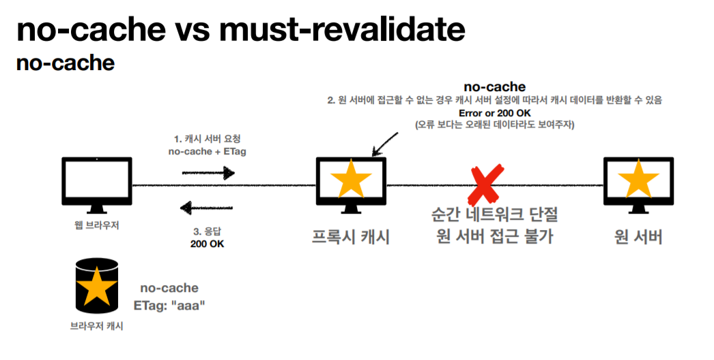
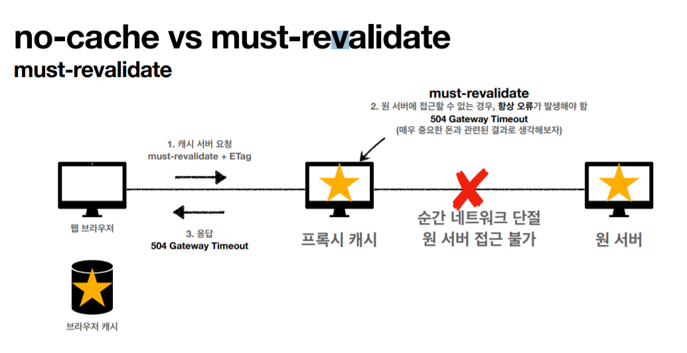

> ###  [인프런 - 모든 개발자를 위한 HTTP 웹 기본 지식](https://www.inflearn.com/course/http-%EC%9B%B9-%EB%84%A4%ED%8A%B8%EC%9B%8C%ED%81%AC/dashboard)을 보고 정리

<br>
<br>

# **캐시 기본 동작**

### **1. 캐시가 없을때**
> 요청 할때마다 해당 데이터를 다시 다운로드 받는다. 

- 데이터가 변경되지 않아도 계속 네트워크를 통해서 데이터를 다운로드 받아야 한다.
- 인터넷 네트워크는 매우 느리고 비싸다.
- 브라우저 로딩 속도가 느리다.
- 느린 사용자 경험

### **2. 캐시 적용**


**첫번쨰 요청 시** 
- 응답데이터에 cache-control 헤더에 max-age가 추가되어 온다.
    - Max-age : 60초동안 캐시 유효
    - 서버에서 캐시 설정 해줘야함 

- 응답받은 브라우저는 캐시 저장소에 응답결과와 유효기간 저장 

> **웹브라우저에는 캐시를 저장하는 저장소가 있다.**  
```
응답 메세지에 cache-control 헤더 필드가 존재한다면 브라우저는 이를 캐시로 인식하고 브라우저의 캐시 저장소에 저장
```

**두번쨰 요청 시** 
- 캐시를 우선 뒤져서 동일한 요청의 캐시 데이터가 유효한 시간 내에 있으면 바로가져온다. 

- 캐시 덕분에 캐시 가능 시간동안 네트워크를 사용하지 않아도 된다.
- 비싼 네트워크 사용량을 줄일 수 있다.
- 브라우저 로딩 속도가 매우 빠르다.
- 빠른 사용자 경험

### **3. 캐시 유효시간 초과 시**
- 캐시 유효 시간이 초과하면, 서버를 통해 데이터를 다시 조회하고, 캐시를 갱신한다.
- 이때 다시 네트워크 다운로드가 발생한다.

---

# **검증 헤더와 조건부 요청1**

캐시 유효시간 초과 시 서버에 다시 요청할때 다음 두 가지 상황으로 나뉜다.
1. 서버에서 기존 데이터를 변경함
2. 서버에서 기존 데이터를 변경하지 않음 

2번의 경우 데이터가 변경되지 않았는데 다시 요청하여 다운로드 받는 것은 매우 비효율적

> **클라이언트의 데이터와 서버의 데이터가 같다는 확신**만 있다면 다시 다운로드 받지 않고 캐시의 데이터를 사용하여 해결할 수 있을 것이다.


### **Last-Modified : 검증헤더 추가** 
검증 할 수 있는 값
### **if-modified-since : 조건부헤더 추가** 
만약 변경 되었으면 어떤 조치를 취하겠다.

    이 두 헤더를 조합해서 캐시 데이터가 서버에서 갱신이 되었는지 안되었는지 확인할수 있다.


**첫번째 요청시**
- 서버가 응답 헤더에 **Last-Modified, 데이터의 최종 수정일 추가하여 응답**.
- 브라우저는 캐시 저장소에 데이터, 유효기간 뿐아니라 **데이터 최종 수정일**도 추가함 

**두번째 요청시**
- 브라우저가 캐시 저장소를 확인, 캐시의 유효기간이 초과되었다.
- 서버에 요청, **요청 헤더 if-modified-since에 캐시 저장소에 들어있던 데이터 최종수정일 추가 후 전송**

- **서버는 전달 받은 데이터 최종 수정일과 실제 데이터의 최종 수정일을 비교(검증)** 

- **데이터가 변경되지 않았으면 304(Not Modified) 리턴** 
    - 이때 응답 헤더에는 캐시 메타데이터 [cache-control(유효기간), Last-Modified..] 만 존재  
    - HTTP Body는 비어 있다.

- 클라이언트는 다시 응답받은 캐시의 메타 데이터들을 캐시저장소에서 갱신한다. 
    - ex) cache-control, Last-Modified...

- 이제 요청 시 캐시의 유효기간이 다시 늘어 났으므로 **브라우저는 캐시의 데이터를 사용**하게 된다.

### 정리
- 캐시 유효 시간이 초과해도, 서버의 데이터가 갱신되지 않으면
- 304 Not Modified + 헤더 메타 정보만 응답(바디X)
- 클라이언트는 서버가 보낸 응답 헤더 정보로 캐시의 메타 정보를 갱신
- 클라이언트는 캐시에 저장되어 있는 데이터 재활용
- 결과적으로 네트워크 다운로드가 발생하지만 용량이 적은 헤더 정보만 다운로드
- 매우 실용적인 해결책
### 팁
    - 304를 위해 캐시의 유효기간이 끝나도 바로 삭제되진 않는다. 
	- 브라우저마다 캐시 삭제 주기는 다르다

# **검증 헤더와 조건부 요청2**

- **검증 헤더**
    - 캐시 데이터와 서버 데이터가 같은지 검증하는 데이터
    - Last-Modified , ETag
- **조건부 요청 헤더**
    - 검증 헤더로 조건에 따른 분기
    - If-Modified-Since: Last-Modified 사용
    - If-None-Match: ETag 사용
    - 조건이 만족하면 200 OK
    - 조건이 만족하지 않으면 304 Not Modified

## **Last-Modified, if-Modified-Since**
이후에 데이터가 수정되었으면? 
> 수정되면 True(200), 수정되지 않으면 False(304) 
- **데이터 미변경 예시**
    - 캐시: 2020년 11월 10일 10:00:00 vs 서버: 2020년 11월 10일 10:00:00
    - **304 Not Modified**, 헤더 데이터만 전송(BODY 미포함)
    - 전송 용량 0.1M (헤더 0.1M, 바디 1.0M)
- **데이터 변경 예시**
    - 캐시: 2020년 11월 10일 10:00:00 vs 서버: 2020년 11월 10일 **11**:00:00
    - **200 OK**, 모든 데이터 전송(BODY 포함)
    - 전송 용량 1.1M (헤더 0.1M, 바디 1.0M)

### Last-Modified, If-Modified-Since 단점
- 날짜 데이터의 최소 단위가 초이기 때문에 1초 미만(0.x초) 단위로 캐시 조정이 불가능
- 날짜 기반의 로직 사용
- 데이터를 수정해서 날짜가 다르지만, 같은 데이터를 수정해서 데이터 결과가 똑같은 경우
- 서버에서 별도의 캐시 로직을 관리하고 싶은 경우
    - 예) 스페이스나 주석처럼 크게 영향이 없는 변경에서 캐시를 유지하고 싶은 경우
- 캐시 매커니즘을 컨트롤하고 싶을때 etag 사용 

## **ETag, If-None- Match**
만약 일치하지 않는다면? 
> ETag값이 일치하지 않는다면 True(200), 일치하면 False(304)

- ETag(Entity Tag)
- 캐시용 데이터에 임의의 고유한 버전 이름을 달아둠
    - 예) ETag: "v1.0", ETag: "a2jiodwjekjl3"
- 데이터가 변경되면 이 이름을 바꾸어서 변경함(Hash를 다시 생성)
    - 예) ETag: "aaaaa" -> ETag: "bbbbb"
- 진짜 단순하게 ETag만 보내서 같으면 유지, 다르면 다시 받기!

```
ETag, If-None-Match도 Last-Modified, if-Modified-Since와 비슷하게

- 첫 번쨰 요청 후 Etag를 응답헤더로 응답받고 

- 두 번째 요청 시 캐시 유효기간 초과시 

- ETag가 있으면 If-None-Match 요청헤더에 ETag 추가하여 전송 

- 서버에서 ETag값을 비교하여 304(HTTP Body X) 또는 200을 응답 한다. 

- 클라이언트는 캐시 메타 데이터를 갱신 

- 그 후 요청 시 캐시 유효기간이 늘어났기 때문에 캐시 데이터 재 사용
```

### ETag, If-None- Match 정리
- 진짜 단순하게 ETag만 서버에 보내서 같으면 유지, 다르면 다시 받기!
- **캐시 제어 로직을 서버에서 완전히 관리**
- 클라이언트는 단순히 이 값을 서버에 제공(클라이언트는 캐시 메커니즘을 모름)
- 예)
    - 서버는 배타 오픈 기간인 3일 동안 파일이 변경되어도 ETag를 동일하게 유지
    - 애플리케이션 배포 주기에 맞추어 ETag 모두 갱신


# **캐시와 조건부 요청 헤더**

캐시와 관련된 헤더들 정리 

캐시 제어 헤더
- Cache-Control: 캐시 제어
- Pragma: 캐시 제어(하위 호환)
- Expires: 캐시 유효 기간(하위 호환)

> Pragma,와 Expires는 Cache-Control의 하위호환용으로 사용, 지금은 Cache-Control로 모든 기능 사용 가능 

### **Cache-Control - 캐시 지시어(directives)**
- Cache-Control: max-age
    - 캐시 유효 시간, 초 단위
- Cache-Control: no-cache
    - 데이터는 캐시해도 되지만, 항상 원(origin) 서버에 검증하고 사용
    - 항상 검증헤더, 조건부 헤더로 데이터를 검증하고 사용하라
- Cache-Control: no-store
    - 데이터에 민감한 정보가 있으므로 저장하면 안됨
    - (메모리에서 사용하고 최대한 빨리 삭제)

### Pragma - 캐시 제어(하위 호환)
- Pragma: no-cache
- HTTP 1.0 하위 호환

### Expires - 캐시 만료일 지정(하위 호환)
- expires: Mon, 01 Jan 1990 00:00:00 GMT
- 캐시 만료일을 정확한 날짜로 지정
- HTTP 1.0 부터 사용
- 지금은 더 유연한 Cache-Control: max-age 권장
- **Cache-Control: max-age와 함께 사용하면 Expires는 무시**

## 검증 헤더와 조건부 요청 헤더

- 검증 헤더 (Validator)
    - ETag: "v1.0", ETag: "asid93jkrh2l"
    - Last-Modified: Thu, 04 Jun 2020 07:19:24 GMT
- 조건부 요청 헤더 (분기 처리)
    - If-Match, If-None-Match: ETag 값 사용
    - If-Modified-Since, If-Unmodified-Since: Last-Modified 값 사용

# **프록시 캐시**


원서버는 물리적으로 너무 멀기 떄문에 클라이언트가 요청시 프록시 캐시 서버로 요청하게 만든다. 
- CDN방식이 이런식으로 되어 있다고 함
 
### 일반적인 프록시 캐시 방식

- 처음 요청하는 유저는 느림 
    - 프록시 캐시 서버에 요청하고 
    - 프록시 캐시서버에서 원서버에 요청하여 public캐시에 저장 
- 두번쨰 유저 부터는 프록시 캐시서버의 public캐시에서 다운받기 때문에 빠름. 

```
Public캐시 : 중간에서 공용으로 사용하는 캐시

Private 캐시 : 웹브라우저나 로컬에 저장되는 캐시  
```
Cache-Control 캐시 지시어(directives) - 기타

- **Cache-Control: public**
    - 응답이 public 캐시에 저장되어도 됨
- **Cache-Control: private**
    - 응답이 해당 사용자만을 위한 것임, private 캐시에 저장해야 함(기본값)
- Cache-Control: s-maxage
    - 프록시 캐시에만 적용되는 max-age
- Age: 60 (HTTP 헤더)
    - 오리진 서버에서 응답 후 프록시 캐시 내에 머문 시간(초)


# **캐시 무효화**
```
캐시를 적용하지 않아도 Get요청 같은 경우 클라이언트(브라우저)에서 임의로 캐시를 지정하는 경우가 있다.
이를 방지하기 위해 명시적으로 캐시하지 않겠다 표시.
```
```
캐시를 사용 안하는 설정들도 특정경우에 캐시가 사용 되게 되어있음. 
만약 캐시를 완~전히 사용하고 싶지 않다면 아래 설정들을 전부 넣어줘야 한다. 

예) 통장잔고 같이 매번 바뀌는 데이터는 절대 캐시 X
```
### Cache-Control - 확실한 캐시 무효화 응답
- Cache-Control: no-cache, no-store, must-revalidate
- Pragma: no-cache
    - HTTP 1.0 하위 호환

위 헤더들을 전부 넣어줘야 완벽한 캐시 무효화 

- C**ache-Control: no-cache**
    - 데이터는 캐시해도 되지만, 항상 원 서버에 검증하고 사용(이름에 주의!)
- **Cache-Control: no-store**
    - 데이터에 민감한 정보가 있으므로 저장하면 안됨
    - (메모리에서 사용하고 최대한 빨리 삭제)
- **Cache-Control: must-revalidate**
    - 캐시 만료후 최초 조회시 원 서버에 검증해야함
    - 원 서버 접근 실패시 반드시 오류가 발생해야함 - 504(Gateway Timeout)
    - must-revalidate는 캐시 유효 시간이라면 캐시를 사용함
- **Pragma: no-cache**
    - HTTP 1.0 하위 호환

> 항상 원 서버에 검증 후 사용하는 No-cache가있으면 must-revalidate는 필요없어보이는데? 



```
프록시와 원서버 간의 네트워크가 단절될떄 프록시 캐시 서버는 클라이언트에게 에러를 던지지 않고
프록시 캐시의 오래된 데이터를 보여줄 수 있음. 
(반드시 오래된 데이터를 보여준다는건 아님. 그럴 수 있는 설정이 있다는것!)
```



```
must-revalidate는 항상 원서버에 접근 , 원서버에 접근이 안되면 에러 발생 
- 504 : Gateway Timeout 

```
캐시 무효화를 하는 경우
- 예) 통장잔고같은게 프록시 캐시 서버의 과거 데이터가 보이면 안될것이다. 
