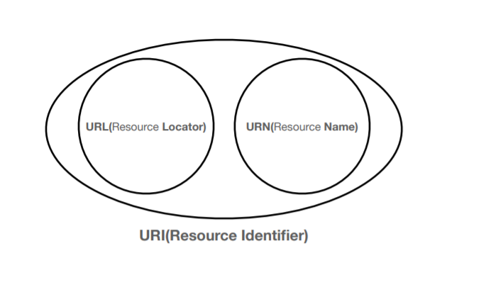

> ###  [인프런 - 모든 개발자를 위한 HTTP 웹 기본 지식](https://www.inflearn.com/course/http-%EC%9B%B9-%EB%84%A4%ED%8A%B8%EC%9B%8C%ED%81%AC/dashboard)을 보고 정리

 
 

# URI

## URI란?
* Uniform: 리소스 식별하는 통일된 방식
* Resource: 자원, URI로 식별할 수 있는 모든 것(제한 없음)
* Identifier: 다른 항목과 구분하는데 필요한 정보

- URL: Uniform Resource Locator
- URN: Uniform Resource Name

## URL, URN
* URL - Locator: 리소스가 있는 위치를 지정
* URN - Name: 리소스에 이름을 부여
* 위치는 변할 수 있지만, 이름은 변하지 않는다.
* urn:isbn:8960777331 (어떤 책의 isbn URN)
* URN 이름만으로 실제 리소스를 찾을 수 있는 방법이 보편화 되지 않음
* **앞으로 URI를 URL과 같은 의미로 이야기하겠음**

> URI는 URL, URN을 포함한다.

## URL 문법

- scheme
    - 주로 프로토콜 사용
    - 프로토콜 : 어떤 방식으로 자원에 접근할 것인가 하는 약속 규칙
- userinfo
    - URL에 사용자 인증을 포함하여 전송 
    - 거의 사용하지 않는다. 
- host
    - 도메인명 또는 IP주소를 사용
- port
    - 접속 포트 
    - 생략시 프로토콜의 기본 포트번호 사용 
        - http : 80, https : 443
- path
    - 리소스가 있는 경로를 지정
    - 보통 계층적 구조 (알아보기 쉽기 위해서)
- query
    - key=value 형태
    - ?로 시작, &로 구분
    - 웹서버에 제공하는 파라미터
    - 숫자를 적어도 전부 문자형태로 서버로 전송된다.
- fragment
    - 잘 사용하지 않는다.
    - html내의 위치를 이동하는 북마크등으로 사용
    - 서버로 전송하는 정보가 아님

 

# 웹 브라우저 요청 흐름

