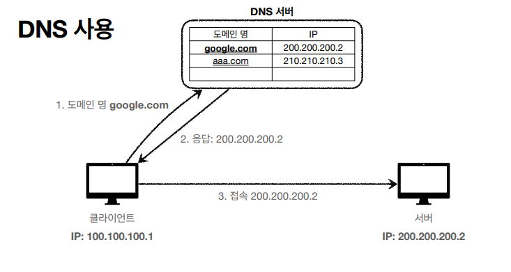

> ###  [인프런 - 모든 개발자를 위한 HTTP 웹 기본 지식](https://www.inflearn.com/course/http-%EC%9B%B9-%EB%84%A4%ED%8A%B8%EC%9B%8C%ED%81%AC/dashboard)을 보고 정리
> ###  

 
 

## 인터넷 통신
인터넷에서 서버와 클라이언트는 어떻게 통신해야 할까? 

복잡한 인터넷망(ISP)을 통해 통신 하려면 <b>IP(인터넷 프로토콜)</b>에 대한 이해가 필수다.

 

## **IP(인터넷 프로토콜)**
복잡한 인터넷 망에서 멀리 떨어져 있는 목적지에 데이터를 보내려면 최소한의 규칙이 있어야 한다.

### 인터넷 프로토콜의 역할
- 지정한 IP 주소(IP Address)에 데이터 전달
- 패킷(Packet)이라는 통신 단위로 데이터 전달

클라이언트와 서버는 서로를 구분 할 수 있는 IP주소를 할당 받아야 하며 IP패킷으로 전송된다.

### 패킷 정보 
- 출발지IP, 목적지IP, 기타정보 
- OSI 3계층 데이터 전송 단위

### IP 프로토콜의 한계
- 비연결성
    - 대상이 서비스 불능이어도 패킷을 전송한다 
        - (상대가 어떤상태인지 모름, 연결되어 있지 않음.)
- 비신뢰성
    - 패킷 소실 : 다양한 이유로 패킷이 소실될 수 있음.
        - Ex) 케이블 단절, 노드 다운
    - 패킷 전달 순서 변경 
        - 패킷의 전달 순서가 바뀔 수 있다.
        - 패킷의 용량이 1500바이트 이상일 때 끊어서 패킷을 전송하는데, 이렇게 전송된 패킷들이 인터넷망에서 동일한 경로로 전송되지 않기 때문에 서버측에서 다른 순서로 패킷을 받을 수 있다. 

> 이러한 IP(인터넷 프로토콜)의 한계점을 극복할 수 있는 것이 TCP프로토콜 이다.

## **TCP, UDP**
IP의 한계점(비연결성, 비신뢰성)을 TCP는 해결해 줄 수 있다. 

UDP는 한계점을 해결해 줄 순 없지만 장점이 있어 함께 정리

**인터넷 프로토콜 스택의 4계층**
- 애플리케이션 계층 - HTTP, FTP
- 전송 계층 - TCP, UDP
- 인터넷 계층 - IP
- 네트워크 인터페이스 계층 - LAN 카드, LAN 드라이버 등등

**프로토콜 계층**

- 'hello'라는 메시지를 전송할때 프로토콜 계층에선 다음과 같은 일이 발생한다.
    1. 애플리케이션에서 메시지 생성
    2. SOCKET라이브러리를 사용해 OS계층에 'hello'라는 메시지를 넘긴다.
    3. TCP프로토콜이 메시지의 TCP정보를 감싸 IP계층으로 넘긴다.
    4. IP계층에서 한번더 IP정보를 감싸 IP패킷을 생성후 아래 계층으로 전송. 
    5. LAN카드를 통해 데이터를 전송

- 생성된 TCP/IP패킷에는 IP패킷에 port정보, 전송제어, 순서, 검증정보등이 추가로 포함 되어 있다.
- TCP에서의 데이터 단위는 세그먼트이다. 

## **TCP 특징**
## 1. **연결 지향 - TCP 3 way handshake(가상 연결)**
    - 실제 물리적으로 연결된 것은 아니고, 논리적으로 연결 된 것(중간 노드들은 연결 되었는지 모른다.)

### 연결지향을 위해 TCP 3way handshake를 통해 먼저 연결한다.
1. 클라이언트에서 서버로 연결메시지(SYN)를 전송
2. 서버도 클라이언트에 연결 메시지에 대한 응답(ACK)과 연결메시지(SYN)를 전송
3. 클라이언트는 서버가 보낸 요청에 대한 응답(ACK)을 보낸다. 

> 이렇게 연결이 되고 나서 데이터를 전송한다. 

- 요즘엔 ACK과 함께 데이터를 전송할 수있다고 한다.

## 2. **데이터 전달 보증**
    - 데이터를 전송하고 전송 잘 받았으면 응답 전송 
        - 응답이 안오면 문제가 있다고 인지

## 3. **순서 보장**
    - 최적화 방법으로는 여러가지가 있지만 기본적으로는 패킷의 순서가 잘못왔을때 그 패킷부터 다시 보내라고 요청한다.

> 이 같은 기능들은 TCP/IP패킷에 전송제어, 순서, 검증정보등이 포함되어 있어서 가능한 것이다. 

### **UDP 특징**
- 사용자 데이터그램 프로토콜(User Datagram Protocol)
- 하얀 도화지에 비유(기능이 거의 없음)
- 연결지향 - TCP 3 way handshake X
- 데이터 전달 보증 X
- 순서 보장 X
- 데이터 전달 및 순서가 보장되지 않지만, 단순하고 빠름
- 정리
- IP와 거의 같다. +PORT +체크섬 정도만 추가
- 애플리케이션에서 추가 작업 필요

### UDP를 왜 사용할까? 
    - TCP계층은 네트워크 표준이기 때문에 더이상의 최적화하기 힘들다. 하지만 UDP는 애플리케이션 레벨에서 기능을 추가해 볼 수 있다.
    - TCP는 3way handshaking, 요청에 대한 응답, TCP패킷에 포함되는 여러 정보들 때문에 속도가 느린 반면 UDP는 빠르다.

## **PORT**
같은 IP내에서 프로세스를 구분하기 위해 PORT가 존재한다.

	0 ~ 1023 까지의 포트를 Well Known Port로 특정 프로토콜에서 사용하는 것으로 예약되어 있는 포트번호 이다. 
	보통 port번호를 사용할때 1024 이후의 포트번호를 사용하는것이 관례 이다.
- FTP - 20, 21
- TELNET - 23
- HTTP - 80
- HTTPS - 443

## **DNS**

- IP는 기억하기 어렵다.
- IP는 변경될 수 있다.

> 이 두가지 문제를 해결하기 위해 DNS를 사용 한다. 

- DNS에 도메인 등록후 도메인으로 요청하면 
- DNS에서 해당 도메인에 맞는 IP를 찾은 후 IP로 전송한다. 

 

